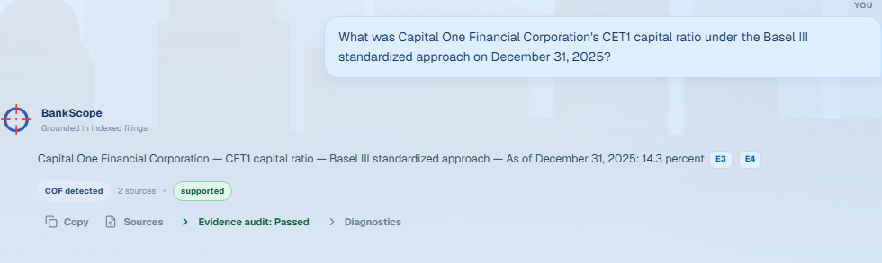
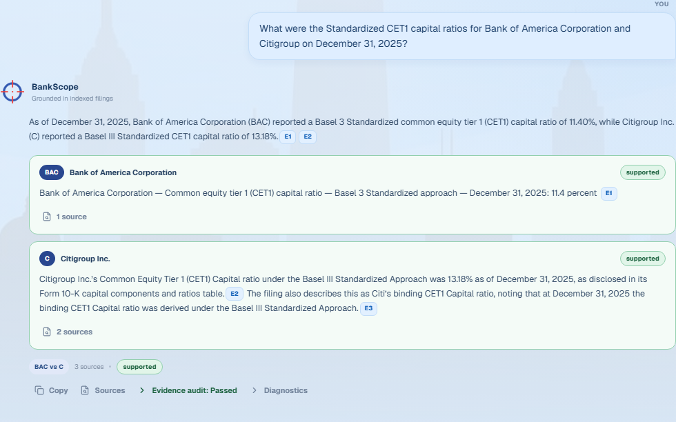
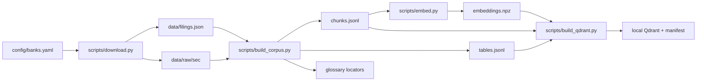
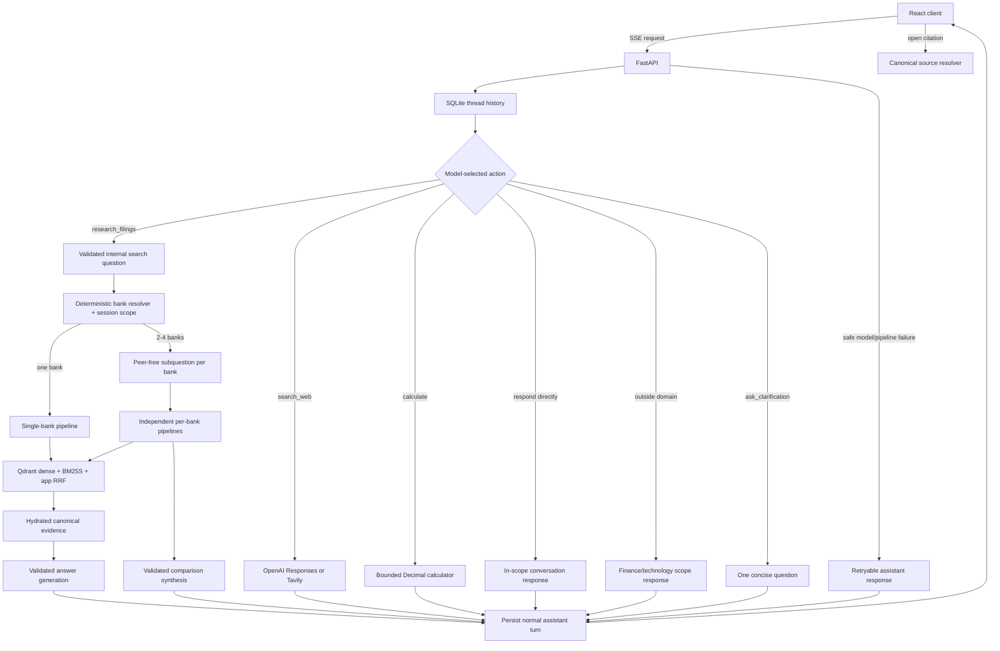

# BankScope RAG Assistant

BankScope is a local, single-user conversational assistant with specialized research access to the
latest downloaded 10-K filings of ten U.S. banks. It combines finance-and-technology conversation,
optional cited web search and deterministic calculation with SEC acquisition, structure-aware corpus construction,
dense and lexical retrieval, evidence-grounded answer generation, conversation memory, and a React
interface.

This repository is organized as a set of documented functional areas. Start here for the
system view, then follow the linked README files for module-level APIs, invariants, and safe
change guidance.

## Product preview

The BankScope workspace supports natural conversation, filing research, cited web search, and
deterministic calculation from one interface.


Ask for an exact filing fact and BankScope returns a validated answer with bank-owned citation
chips, answer status, and an optional evidence audit.



Multi-bank comparisons retrieve and validate each bank independently before presenting the
combined result with clearly separated evidence ownership.



These are captures from the live React/FastAPI application, not mockups. See the
[QA capture notes](docs/final-report-assets/qa-demo-2026-08-31/README.md) for the questions,
diagnostics, canonical source views, and reproduction details. The
[demo preparation guide](docs/demo-priprema.md) provides the recommended presentation flow and
offline fallback.

## What the system does

- downloads configured bank filings from SEC EDGAR;
- parses narrative text and complete tables with `sec2md==0.1.23`;
- builds bounded retrieval records while preserving canonical evidence;
- stores dense vectors in local Qdrant and lexical records in BM25S;
- fuses dense and lexical rankings with reciprocal-rank fusion (RRF);
- answers single-bank and two-to-four-bank comparison questions with independently retrieved,
  bank-owned evidence and citations;
- handles finance-and-technology conversation, clarifications, and natural follow-ups without
  requiring filing retrieval, while declining unrelated content;
- selects indexed filing research, cited OpenAI/Tavily web search, or a safe Decimal calculator
  only when the request needs that tool;
- sends each threaded request a 12,000-token-bounded summary plus raw transcript, retaining at
  least the six newest complete pairs during compaction;
- lets the model shorten, translate, simplify, or reformat the previous grounded answer while
  preserving its citation subset and blocking new numbers, banks, and qualifiers;
- preserves original wording beside validated rewrites and adds bank-scoped concept searches for
  operational risk, cybersecurity, third-party risk, and CET1;
- returns grounded results through one of four strict answer functions with one bounded repair retry;
- validates the model's source-selection and clarification decisions before retrieval;
- diversifies retrieval across five filing aspects for whole-10-K summary requests;
- persists local threads and citation metadata in SQLite;
- accepts thread-scoped PDF, text, Markdown, CSV, JSON, Word, and Excel uploads and answers from
  their parsed content with document-owned citations;
- evaluates retrieval, generation, conversation memory, and comparisons separately.

## Quick start

Requirements:

- Python 3.13 and Git;
- Node.js `^20.19.0` or `>=22.12.0` and npm;
- access to the configured OpenAI-compatible model gateway;
- a SEC-compliant application name and contact email.

From PowerShell in the repository root:

```powershell
python -m venv .venv
.\.venv\Scripts\Activate.ps1
python -m pip install -e ".[dev,llm]"
Copy-Item .env.example .env
npm.cmd install --prefix frontend
```

Install `.[dev,llm,docling]` instead when Word, Excel, scanned PDF, or other layout-aware document
parsing is needed. Text-based PDFs use the lightweight parser already installed with the project.

Populate `.env`, then build the local data products:

```powershell
python scripts/download.py
python scripts/build_corpus.py --overwrite
python scripts/embed.py --device cuda --overwrite
python scripts/build_qdrant.py --recreate
```

The processed corpus and Qdrant index are generated locally and are not included in a fresh
clone. A CUDA GPU is required for the practical full-corpus embedding build; acquisition, parsing,
Qdrant construction and evaluation remain CPU tasks. If the development machine has no CUDA GPU,
build the upload bundle with `python scripts/build_colab_bundle.py --overwrite`, then use
[`notebooks/BankScope_GPU_Evaluation_Colab.ipynb`](notebooks/BankScope_GPU_Evaluation_Colab.ipynb)
and follow [`notebooks/README.md`](notebooks/README.md). `embed.py` and the notebook pin the same model
revision. The embedding step also populates the query model in the local Hugging Face cache; API
startup deliberately has no network fallback for that model.

Start the API and frontend together on Windows:

```powershell
.\start-app.ps1
```

The API is served at `http://127.0.0.1:8000` and Vite at `http://localhost:5173`. Embedded
Qdrant permits one process to own its local storage, so stop an earlier BankScope Python
process before launching another application instance.

Bounded agentic RAG is experimental and remains disabled by default. Set
`AGENTIC_RAG_ENABLED=true` only for local evaluation; the initial Qdrant + BM25S + RRF retrieval
is unchanged and remains first in the final evidence order. After that initial evidence, each bank
gets an isolated, bounded loop that may run
`search_hybrid`, literal `search_exact`, bounded `read_context`, or `finish`. Runtime limits the
loop to three orchestration model requests, one retrieval/read action, and one verifier request per
bank.

```dotenv
# .env
AGENTIC_RAG_ENABLED=true
```

Restart the API after changing the flag because settings and the long-lived pipeline are loaded
once per process. In the UI, open the collapsed **Diagnostics** panel on a turn and confirm
`Agentic RAG: enabled`, the route, per-bank loop trace, evidence counts, model/tool/verifier
requests, and execution checks. Restore the value to `false` and restart to return to baseline
behavior.

Compare baseline and agentic runs with:

```powershell
python scripts/evaluate_agentic_rag.py --prerequisite-gates-passed
```

The switch must remain off unless that report and the existing frozen quality gates pass. See
[ADR 013](docs/decisions/013-rag-reliability-hardening.md) for the current design and rollout
contract. [ADR 012](docs/decisions/012-bounded-hybrid-agent-loop.md) and
[ADR 011](docs/decisions/011-eval-first-agentic-rag.md) preserve the superseded experiments and
their measured results.

Web search defaults to an `auto` provider chain. It tries the OpenAI Responses `web_search` tool
first and, when `TAVILY_API_KEY` is configured, falls back to Tavily and remembers the successful
provider. The current corporate gateway returned `404` for `/responses` in the live smoke, so set a
Tavily key to enable web answers in that environment. If no provider succeeds, BankScope returns a
specific web-unavailable state and never presents an uncited answer as current:

```dotenv
WEB_SEARCH_ENABLED=true
WEB_SEARCH_PROVIDER=auto
WEB_SEARCH_MODEL=
WEB_SEARCH_TIMEOUT_SECONDS=45
WEB_SEARCH_CONTEXT_SIZE=medium
TAVILY_API_KEY=
TAVILY_MAX_RESULTS=5
```

See [ADR 015](docs/decisions/015-general-chat-web-and-calculator.md) for the reviewed chatbot
repositories, provider comparison, calculator safety contract, and the Ally failure analysis.
[ADR 016](docs/decisions/016-finance-technology-conversation-scope.md) defines the current
finance-and-technology conversation boundary.

For separate terminals:

```powershell
cd frontend
npm.cmd run api  # terminal 1
npm.cmd run dev  # terminal 2
```

See [scripts/README.md](scripts/README.md) for every command and
[frontend/README.md](frontend/README.md) for the browser/API development workflow.

## Architecture

### Offline data pipeline



Narrative records are bounded and may overlap. Parser-emitted tables are never split again:
retrieval searches one compact description, then hydrates the hit back to the complete table.
Glossary locators are lexical-only records that point to the same canonical table ID.

### Online question and answer flow



The current question selects a bank or an ordered set of two to four banks. When it does not, the
server-owned thread scope and bounded history can supply follow-up context. The router may answer
directly, ask one clarification, decline a request outside finance and technology, or select filing
research, web search, or calculation. Greetings, acknowledgements, capability questions, relevant
answer transformations, and general arithmetic remain available. Research rewrites are disposable,
validated search inputs; the original message remains authoritative. Previous answers re-enter only
as conversational context and may support their own transformation, never a new filing claim.
Expected model failures return a normal
retryable assistant turn rather than an empty/error-only conversation.

## Repository map

| Area | Responsibility | Detailed guide |
|---|---|---|
| `src/bankscope/` | Reusable Python application logic | [Package guide](src/bankscope/README.md) |
| `scripts/` | Pipeline, serving, evaluation, and utility entry points | [CLI guide](scripts/README.md) |
| `frontend/` | React/Vite local product interface | [Frontend guide](frontend/README.md) |
| `config/` | Validated bank registry input | [Configuration guide](config/README.md) |
| `data/` | Versioned inputs and generated data contracts | [Data guide](data/README.md) |
| `tests/` | Active unit and integration tests | [Test guide](tests/README.md) |
| `docs/` | Decisions, roadmap, and evaluation reports | [Documentation index](docs/README.md) |
| `notebooks/` | Reproducible GPU evaluation workflow | [Notebook guide](notebooks/README.md) |
| `assets/brand/` | Canonical editable and generated brand assets | [Brand guide](assets/brand/README.md) |
| `sandbox/` | Superseded code and completed experiments | [Archive guide](sandbox/README.md) |

The `src` layout itself is explained in [src/README.md](src/README.md). Generated `artifacts/`,
tool caches, virtual environments, and local databases are not application source and are ignored.

## Runtime contracts

- `config/banks.yaml` is the source of truth for supported banks and aliases.
- `data/filings.json` is the versioned filing manifest; downloaded filings are local artifacts.
- `chunks.jsonl` is the retrieval corpus; `tables.jsonl` is canonical table evidence.
- `embeddings.npz` must match the ordered chunk IDs and source SHA-256.
- `qdrant_manifest.json` ties the local index to its corpus, model, dimensions, and collection.
- SQLite owns thread state and citation metadata, not canonical filing content.
- Invalid, stale, ambiguous, or insufficient evidence fails closed instead of being guessed.

Schema and lifecycle details live in [data/README.md](data/README.md). Architectural reasons and
measured trade-offs live in [docs/decisions/README.md](docs/decisions/README.md).

## Useful commands

```powershell
python scripts/search.py "operational risk capital" --ticker JPM
python scripts/answer.py "How does JPMorgan Chase define cybersecurity risk?"
python scripts/evaluate.py
python scripts/evaluate_answers.py --model AZURE_GPT_51_2025_1113
python scripts/evaluate_conversation_memory.py --model AZURE_GPT_51_2025_1113
python scripts/evaluate_comparisons.py --model AZURE_GPT_51_2025_1113
python scripts/smoke_answers.py --model AZURE_GPT_51_2025_1113
```

Filtered corpus builds must use a separate output directory so a smoke run cannot replace the
complete ten-bank corpus. Use `build_qdrant.py --recreate` only for an intentional full rebuild.

## Quality checks

```powershell
python -m pytest
python -m ruff check .
python -m ruff format --check .
cd frontend
npm.cmd run lint
npm.cmd test
npm.cmd run build
```

Before changing parsing, chunking, embeddings, retrieval, or answer generation, follow the
acceptance gates in [docs/roadmap.md](docs/roadmap.md) and record measured decisions as ADRs.

## Known limitations

- The active registry covers ten banks and one downloaded 2025 Form 10-K per bank. Adding a bank
  or filing requires acquisition, corpus/embedding/index rebuilds, and renewed evaluation.
- A table emitted by sec2md as separate continuation elements remains separate; BankScope only
  guarantees that each emitted table is not split further.
- Retrieval scores are rankings, not answerability probabilities.
- The accepted GPT-5.1 generation candidate retains one documented rounded-citation caveat; see
  [docs/generation_hardening.md](docs/generation_hardening.md).
- Agentic RAG remains an opt-in experiment until its live additive-retrieval gate passes; the
  deterministic baseline is the safe default.
- Web answers require either an OpenAI-compatible gateway implementing Responses `web_search` or a
  Tavily key. Provider failures return an explicit retryable web state; Brave remains a future A/B
  candidate.
- Authentication, multi-user infrastructure, cloud persistence, and deployment are out of scope.
