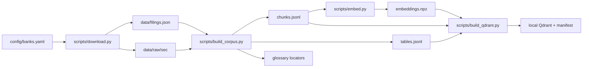
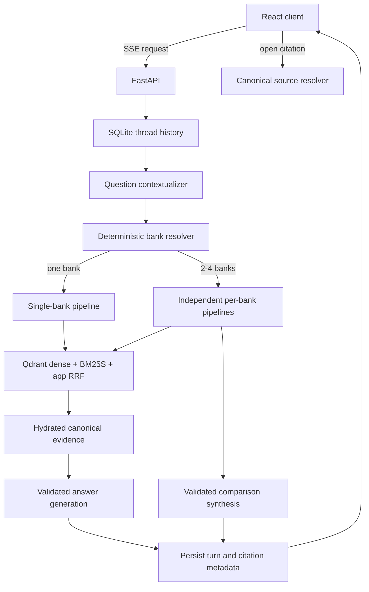

# BankScope RAG Assistant

BankScope is a local, single-user research assistant for exploring the latest downloaded
10-K filings of ten U.S. banks. It combines deterministic SEC acquisition, structure-aware
corpus construction, dense and lexical retrieval, evidence-grounded answer generation,
conversation memory, and a React interface.

This repository is organized as a set of documented functional areas. Start here for the
system view, then follow the linked README files for module-level APIs, invariants, and safe
change guidance.

## What the system does

- downloads configured bank filings from SEC EDGAR;
- parses narrative text and complete tables with `sec2md==0.1.23`;
- builds bounded retrieval records while preserving canonical evidence;
- stores dense vectors in local Qdrant and lexical records in BM25S;
- fuses dense and lexical rankings with reciprocal-rank fusion (RRF);
- answers single-bank and two-to-four-bank comparison questions with citations;
- contextualizes bounded conversation history without treating prior answers as evidence;
- persists local threads and citation metadata in SQLite;
- evaluates retrieval, generation, conversation memory, and comparisons separately.

## Quick start

Requirements:

- Python 3.13 and Git;
- Node.js `^20.19.0` or `>=22.12.0` and npm;
- access to the configured OpenAI-compatible model gateway;
- a SEC-compliant application name and contact email.

From PowerShell in the repository root:

```powershell
python -m venv .venv
.\.venv\Scripts\Activate.ps1
python -m pip install -e ".[dev,llm]"
Copy-Item .env.example .env
npm.cmd install --prefix frontend
```

Populate `.env`, then build the local data products:

```powershell
python scripts/download.py
python scripts/build_corpus.py --overwrite
python scripts/embed.py --overwrite
python scripts/build_qdrant.py
```

The processed corpus and Qdrant index are generated locally and are not included in a fresh
clone. `embed.py` also populates the pinned query model in the local Hugging Face cache; API
startup deliberately has no network fallback for that model.

Start the API and frontend together on Windows:

```powershell
.\start-app.ps1
```

The API is served at `http://127.0.0.1:8000` and Vite at `http://localhost:5173`. Embedded
Qdrant permits one process to own its local storage, so stop an earlier BankScope Python
process before launching another application instance.

For separate terminals:

```powershell
cd frontend
npm.cmd run api  # terminal 1
npm.cmd run dev  # terminal 2
```

See [scripts/README.md](scripts/README.md) for every command and
[frontend/README.md](frontend/README.md) for the browser/API development workflow.

## Architecture

### Offline data pipeline



Narrative records are bounded and may overlap. Parser-emitted tables are never split again:
retrieval searches one compact description, then hydrates the hit back to the complete table.
Glossary locators are lexical-only records that point to the same canonical table ID.

### Online question and answer flow



The current question selects a bank or an ordered set of two to four banks. When it does not,
the server-owned thread scope supplies follow-up context. Up to four completed turns from the
same thread may rewrite the latest question for retrieval; previous assistant text never becomes
filing evidence.

## Repository map

| Area | Responsibility | Detailed guide |
|---|---|---|
| `src/bankscope/` | Reusable Python application logic | [Package guide](src/bankscope/README.md) |
| `scripts/` | Pipeline, serving, evaluation, and utility entry points | [CLI guide](scripts/README.md) |
| `frontend/` | React/Vite local product interface | [Frontend guide](frontend/README.md) |
| `config/` | Validated bank registry input | [Configuration guide](config/README.md) |
| `data/` | Versioned inputs and generated data contracts | [Data guide](data/README.md) |
| `tests/` | Active unit and integration tests | [Test guide](tests/README.md) |
| `docs/` | Decisions, roadmap, and evaluation reports | [Documentation index](docs/README.md) |
| `notebooks/` | Reproducible GPU evaluation workflow | [Notebook guide](notebooks/README.md) |
| `assets/brand/` | Canonical editable and generated brand assets | [Brand guide](assets/brand/README.md) |
| `sandbox/` | Superseded code and completed experiments | [Archive guide](sandbox/README.md) |

The `src` layout itself is explained in [src/README.md](src/README.md). Generated `artifacts/`,
tool caches, virtual environments, and local databases are not application source and are ignored.

## Runtime contracts

- `config/banks.yaml` is the source of truth for supported banks and aliases.
- `data/filings.json` is the versioned filing manifest; downloaded filings are local artifacts.
- `chunks.jsonl` is the retrieval corpus; `tables.jsonl` is canonical table evidence.
- `embeddings.npz` must match the ordered chunk IDs and source SHA-256.
- `qdrant_manifest.json` ties the local index to its corpus, model, dimensions, and collection.
- SQLite owns thread state and citation metadata, not canonical filing content.
- Invalid, stale, ambiguous, or insufficient evidence fails closed instead of being guessed.

Schema and lifecycle details live in [data/README.md](data/README.md). Architectural reasons and
measured trade-offs live in [docs/decisions/README.md](docs/decisions/README.md).

## Useful commands

```powershell
python scripts/search.py "operational risk capital" --ticker JPM
python scripts/answer.py "How does JPMorgan Chase define cybersecurity risk?"
python scripts/evaluate.py
python scripts/evaluate_answers.py --model AZURE_GPT_51_2025_1113
python scripts/evaluate_conversation_memory.py --model AZURE_GPT_51_2025_1113
python scripts/evaluate_comparisons.py --model AZURE_GPT_51_2025_1113
```

Filtered corpus builds must use a separate output directory so a smoke run cannot replace the
complete ten-bank corpus. Use `build_qdrant.py --recreate` only for an intentional full rebuild.

## Quality checks

```powershell
python -m pytest
python -m ruff check .
python -m ruff format --check .
cd frontend
npm.cmd run lint
npm.cmd test
npm.cmd run build
```

Before changing parsing, chunking, embeddings, retrieval, or answer generation, follow the
acceptance gates in [docs/roadmap.md](docs/roadmap.md) and record measured decisions as ADRs.

## Known limitations

- The downloaded USB and WFC primary filings point to separate annual-report attachments, so
  their current local content is partial.
- A table emitted by sec2md as separate continuation elements remains separate; BankScope only
  guarantees that each emitted table is not split further.
- Retrieval scores are rankings, not answerability probabilities.
- The accepted GPT-5.1 generation candidate retains one documented rounded-citation caveat; see
  [docs/generation_hardening.md](docs/generation_hardening.md).
- Authentication, multi-user infrastructure, cloud persistence, and deployment are out of scope.
