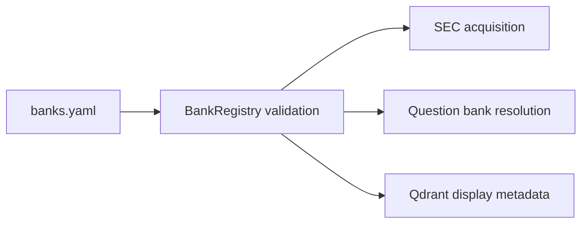

# Configuration

**Status:** active runtime input.

This folder contains small, reviewable configuration that defines the supported BankScope
domain. Secrets and machine-specific settings do not belong here.

```text
config/
├── banks.yaml   # supported banks, CIKs, legal names, aliases, and enabled flags
└── README.md
```



## `banks.yaml` contract

Each bank entry supplies a ticker, ten-digit SEC CIK, legal name, optional aliases, and an
`enabled` flag. [`BankCompany`](../src/bankscope/sec/README.md) normalizes tickers and aliases;
`BankRegistry` rejects duplicate tickers, duplicate CIKs, and registries with no enabled bank.

The registry is consumed by `download.py`, `build_qdrant.py`, and the answer pipeline. A rename or
alias change can therefore affect acquisition, filters, conversation scope, and citations.

## Environment configuration

`.env.example` in the repository root documents environment-backed settings. Copy it to `.env`
for local use. `.env` is ignored and must never be committed. `ApplicationSettings` validates the
SEC user agent, request rate, data paths, and model gateway fields.

## When changing this area

1. Keep CIKs zero-padded to ten digits and aliases unique after normalization.
2. Update resolver tests for new names or aliases.
3. Re-run download/index commands only when the changed field affects their artifacts.
4. Run `python -m pytest tests/test_company_registry.py tests/test_bank_resolver.py`.

[Back to repository guide](../README.md)

