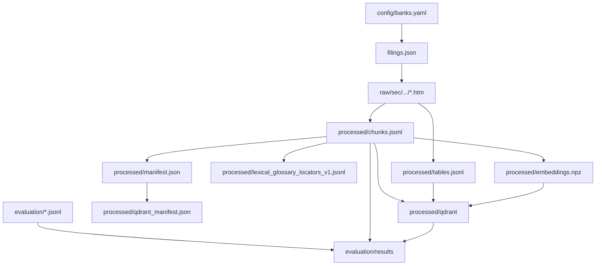

# Data lifecycle and contracts

**Status:** active inputs plus locally generated artifacts.

BankScope treats data as a lineage, not as interchangeable files. Small manifests and evaluation
contracts are versioned; downloaded filings, embeddings, indexes, results, and local chat state are
regenerated or retained only on the developer machine.

```text
data/
├── filings.json                 # tracked SEC filing manifest
├── raw/                         # ignored downloaded filing payloads
├── processed/                   # ignored corpus, vectors, and Qdrant index
├── evaluation/                  # tracked queries/audits; ignored run results
└── local/                       # ignored SQLite application state
```



## Core contracts

| Artifact | Role | Key invariant |
|---|---|---|
| `filings.json` | Acquisition manifest | One current record per downloaded configured filing |
| `chunks.jsonl` | Searchable text and table descriptions | Stable `record_id` and canonical `target_chunk_id` |
| `tables.jsonl` | Complete parser-emitted tables | One document per stable `table_id` |
| `lexical_glossary_locators_v1.jsonl` | Small BM25-only definition records | Every locator resolves to a real parent table |
| `manifest.json` | Corpus provenance | Parser/config/source hashes describe the corpus |
| `embeddings.npz` | Ordered dense vectors | IDs, order, dtype, normalization, model, and source hash validate |
| `qdrant_manifest.json` | Persistent index provenance | Collection, vector schema, point count, and sources match |
| `bankscope_chat.db` | Thread and citation metadata | Canonical evidence remains in the corpus, not SQLite |

Retrieval records contain searchable `embedding_text` and metadata. Hydrated results expose the
canonical `document`: narrative content for text records and the complete Markdown table for table
records. A retrieval score must never replace evidence content.

## Lifecycle rules

- Never hand-edit generated corpus, embedding, Qdrant, result, or SQLite files.
- A hash, record order, dimension, point-count, or table-reference mismatch fails closed.
- A ticker-filtered corpus build must use a separate output directory.
- Deleting generated data is recoverable by rerunning the pipeline; deleting tracked manifests or
  evaluation contracts changes project evidence and requires review.

Read the stage-specific guides:

- [raw acquisition](raw/README.md)
- [processed corpus and indexes](processed/README.md)
- [evaluation data](evaluation/README.md)
- [local application state](local/README.md)

[Back to repository guide](../README.md)

