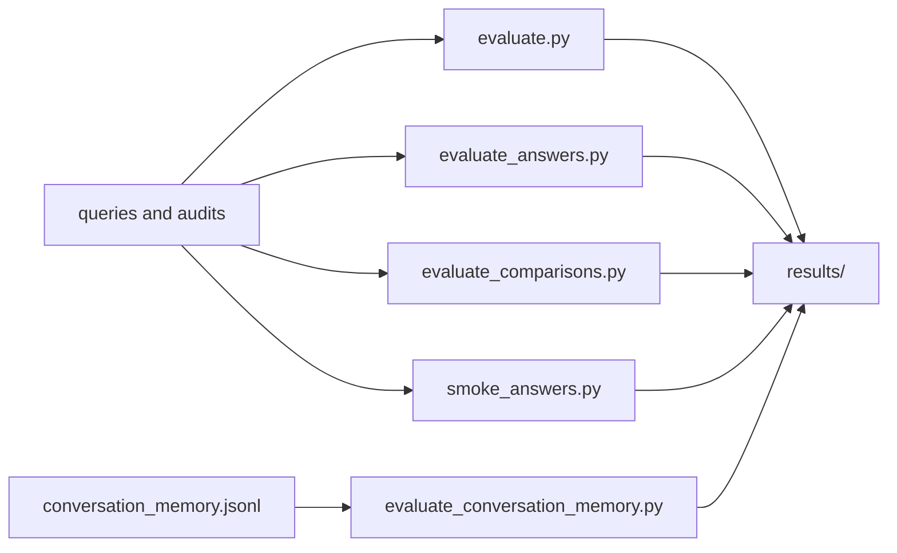

# Evaluation data

**Status:** tracked test contracts plus ignored run results.

```text
evaluation/
├── queries.jsonl                         # retrieval and answer qrels
├── generation_citation_audit_v1.jsonl    # historical manual support audit
├── generation_citation_audit_v2.jsonl    # current manual support audit
├── conversation_memory.jsonl             # bounded follow-up cases
└── results/                               # ignored generated reports
```



Tracked query and audit files are versioned evidence: changing them changes metric denominators and
requires an explicit explanation. Generated results include provenance and belong in `results/`,
which is ignored unless a deliberately frozen decision record summarizes them.

The current contract contains 34 questions: 32 answerable questions across all ten configured
banks, one ambiguous question, and one unsupported-period question. Four COF/STT questions were
added during the complete-primary-filing rebaseline recorded in ADR 009.

The three cross-bank qrels carry explicit ticker pairs. They use deterministic bank-balanced Top 10
retrieval for metrics and isolated per-bank evidence for comparison generation. The current citation
audit includes manually reviewed COF/STT evidence. `application-smoke-10.json` is an ignored,
reproducible batch result covering one supported answer and citation ownership check per bank.

Retrieval, generation, conversation-memory, and comparison gates answer different questions and
must not be collapsed into one score. See [the evaluation package](../../src/bankscope/evaluation/README.md)
and [architectural decisions](../../docs/decisions/README.md).
