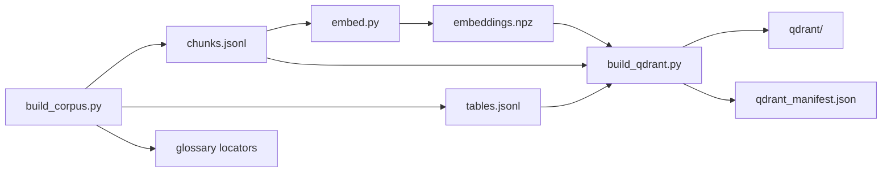

# Processed corpus and indexes

**Status:** generated locally and ignored, except for this guide.

This folder contains every derived artifact between parsing and online retrieval.

```text
processed/
├── chunks.jsonl
├── tables.jsonl
├── lexical_glossary_locators_v1.jsonl
├── manifest.json
├── embeddings.npz
├── qdrant/
└── qdrant_manifest.json
```



`chunks.jsonl` is optimized for retrieval. `tables.jsonl` remains canonical evidence. An NPZ or
Qdrant directory without its matching manifest is not a valid BankScope artifact. Persistent local
Qdrant may be opened by only one process at a time.

Recreate the folder in order with `build_corpus.py --overwrite`, `embed.py --overwrite`, and
`build_qdrant.py`. Only use `--recreate` when intentionally replacing an existing collection.

[Data lifecycle](../README.md) · [Parsing](../../src/bankscope/parsing/README.md) ·
[Retrieval](../../src/bankscope/retrieval/README.md)

