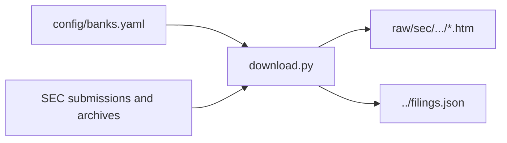

# Raw filing data

**Status:** generated locally and ignored, except for this guide.

`scripts/download.py` writes SEC filing payloads beneath
`data/raw/sec/<cik>/<accession-number>/` and updates the tracked `data/filings.json` manifest.

Downloads use a validated identifying `SEC_USER_AGENT`, respect the configured request rate, and
write atomically. The raw path in the manifest is project-relative; raw content is not committed.

To recreate all raw data, run `python scripts/download.py`. Use `--ticker JPM` for a one-bank
acquisition check. Do not use this folder as a canonical configuration source: the registry and
manifest own identity and provenance.

[Data lifecycle](../README.md)

