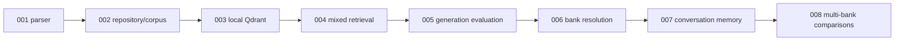

# Architecture decision records

**Status:** accepted historical decisions for the active system.

| ADR | Decision |
|---|---|
| [001](001-parser-selection.md) | Select sec2md using the frozen retrieval comparison |
| [002](002-repository-overhaul.md) | Adopt the active src/scripts/data structure and whole-table corpus |
| [003](003-qdrant-local-retrieval.md) | Accept local Qdrant for persistent dense retrieval |
| [004](004-mixed-vector-retrieval.md) | Use Qdrant dense + BM25S + application RRF by default |
| [005](005-generation-evaluation.md) | Separate deterministic answer metrics from advisory judging |
| [006](006-automatic-bank-resolution.md) | Resolve banks before retrieval with bounded session fallback |
| [007](007-short-term-conversation-memory.md) | Contextualize from four completed same-thread turns |
| [008](008-multi-bank-comparisons.md) | Isolate per-bank evidence before bounded comparison synthesis |

ADRs are append-only records of a decision at a point in time. If a decision is reversed, add a new
ADR and mark the old one superseded rather than rewriting its measured history.

[Documentation index](../README.md)

