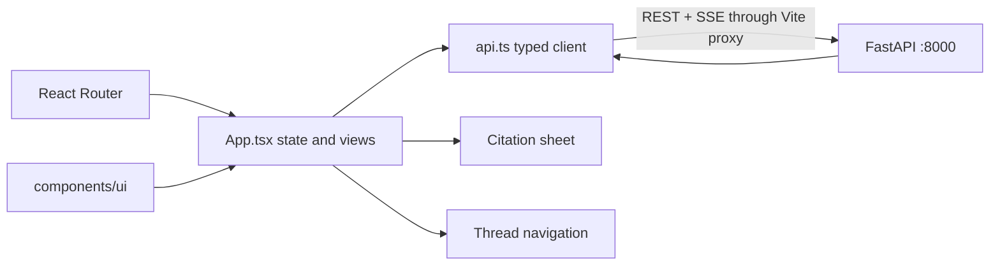

# BankScope frontend

**Status:** active local product interface.

Conversational interface for general chat plus specialized research over indexed 10-K filings,
cited web answers, and deterministic calculations.

## Stack

- React 19 + TypeScript + Vite
- Geist variable font
- Lucide icons
- CSS design tokens using BankScope blue `#3459b1` and red `#ee413b`

## Architecture



See [src/README.md](src/README.md) for the file and type-level map. The browser owns
display state and cancellation; the server owns bank scope, history selection,
retrieval, answer validation, and persistence.

## Run locally

Start the long-lived Python answer service in one terminal:

```powershell
cd frontend
npm.cmd run api
```

Then start Vite in a second terminal:

```powershell
cd frontend
npm.cmd install
npm.cmd run dev
```

Vite proxies `/api` requests to `http://127.0.0.1:8000`. FastAPI keeps the answer
pipeline loaded, while SQLite persists threads, messages, bank context and citations.
The browser receives live pipeline stages over SSE. Historical sources are resolved
from the active canonical corpus when opened instead of being duplicated in the chat
database. The service uses the configured `OPENAI_MODEL`; override it with
`npm.cmd run api -- --model MODEL_NAME`.

The stream sends an immediate status and heartbeat comments during long model work. `api.ts`
assembles fragmented SSE blocks, ignores malformed non-terminal events, and validates final REST
and stream payloads before React receives them. A top-level error boundary replaces a blank screen
with a reload action if an unexpected rendering error still occurs.

To test bounded agentic RAG in the UI, set `AGENTIC_RAG_ENABLED=true` in the repository `.env`, stop
the old API process, and start it again. Each completed or failed turn then has a collapsed
**Diagnostics** panel showing route, feature state, evidence counts, timeline, the per-bank loop
outcome and trace, model/tool/verifier request counts, latencies, and execution checks. Setting the
flag back to `false` and restarting restores baseline routing/retrieval behavior.

## Interface contract

- readiness check -> `GET /api/health`
- thread CRUD -> `/api/threads` and `/api/threads/{thread_id}`
- persisted history -> `GET /api/threads/{thread_id}/messages`
- streamed question -> `POST /api/threads/{thread_id}/stream`
- source context -> `GET /api/citations/{citation_id}/context`
- compatibility question -> `POST /api/answer`
- answer status -> `supported | partial | ambiguous | unsupported`
- dialog act -> `answer | clarification | greeting | acknowledgement | capability |
  general_explanation | contextual_transform | web_answer | web_research_unavailable |
  calculation | out_of_scope | retryable_error`
- filing source chips hydrate canonical evidence; web chips open validated HTTP(S) sources in a
  new `noopener` tab
- bank selection is deliberately absent; the server resolves one bank or an ordered comparison set
- optional and legacy diagnostics are normalized defensively before rendering
- expected threaded model/pipeline failures arrive as answered `retryable_error` turns; red error
  turns are reserved for infrastructure or protocol failures; retryable turns include a guarded
  Retry action that resubmits the original question
- agentic progress can add repeatable `assessing_evidence` events to the baseline
  `embedding`, `retrieving`, `generating`, `validating`, `synthesizing`, and `contextualizing`
  stages; detailed tool actions are carried in terminal diagnostics

## Checks

```powershell
npm.cmd run lint
npm.cmd test
npm.cmd run build
```

## Brand assets

The header wordmark, assistant target and favicon mark are served from `public/brand/`.
Their canonical editable/generated sources live in `../assets/brand/` and can be regenerated
with `node ../scripts/export_logo_from_ai.mjs`. Public URLs remain `/brand/<asset>.svg`.

## When changing this area

1. Keep response types in `src/api.ts` aligned with `bankscope.api` and generated answer fields.
2. Preserve cancellation, fragmented-block parsing, heartbeat handling, and validated terminal SSE
   handling for answer and error events.
3. Keep source content server-resolved; do not persist canonical evidence in browser state.
4. Add or update Testing Library coverage for visible behavior.
5. Run lint, Vitest, and the production build.

[Back to repository guide](../README.md)
