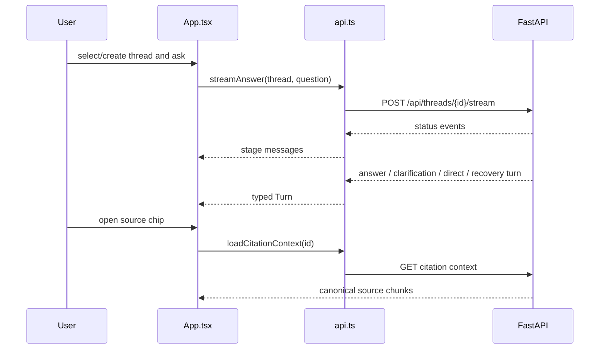

# Frontend source

**Status:** active React/TypeScript implementation.

```text
src/
├── main.tsx                 # browser entry point, recovery boundary, and router
├── ErrorBoundary.tsx        # last-resort render recovery instead of a blank screen
├── App.tsx                  # thread, answer, source, and dialog UI
├── api.ts                   # typed REST/SSE client and wire contracts
├── data.ts                  # static suggestion content
├── index.css                # design tokens and application styling
├── App.test.tsx             # user-visible component behavior
├── test-setup.ts            # Vitest DOM setup
├── components/ui/           # small Radix-based primitives
└── lib/utils.ts             # class-name composition helper
```



## Public TypeScript contracts

`api.ts` exports `Citation`, `NumericFacts`, `BankResult`, `Diagnostics`, `AnswerResponse`,
`ThreadSummary`, `Turn`, `SourceChunk`, `CitationContext`, and `ApiError`. `AnswerResponse.dialog_act`
distinguishes grounded answers, clarifications, direct conversation, and safe retryable recovery.
Its functions list/create/load/rename/delete threads, stream answers, and load citation context.

`streamAnswer()` incrementally parses fragmented CRLF/LF SSE blocks from a fetch `ReadableStream`,
ignores comment heartbeats and malformed intermediate events, and runtime-validates the terminal
turn. A stream must yield a valid answer or error turn before completion; otherwise it raises
`ApiError`. REST responses and legacy diagnostics are also normalized before the UI receives them.
Keep discriminated status/type unions synchronized with backend response models.

`App.tsx` owns routing, selected-thread state, optimistic loading turns, stream cancellation,
dialogs, comparison rendering, Markdown answer presentation, and the source sheet. UI primitives
under `components/ui` should remain behavior-light. `DiagnosticsPanel` is a native collapsed
`details` view for grounded and recovery turns; it must not treat execution checks as a
factual-accuracy score. Direct and clarification turns do not claim filing grounding or display a
meaningless zero-source label.

Run `npm.cmd test` after behavior changes and add a test from the user's perspective rather than
testing component internals.

[Frontend guide](../README.md) · [Backend API](../../src/bankscope/README.md)
