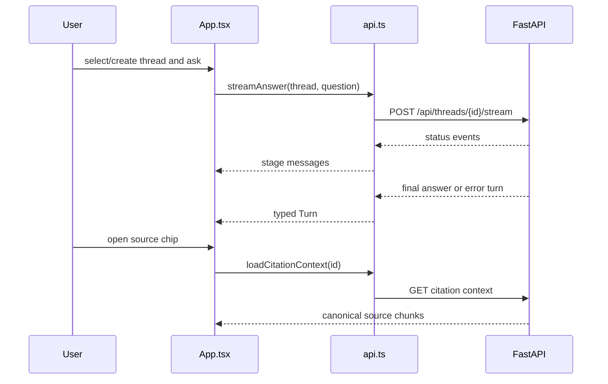

# Frontend source

**Status:** active React/TypeScript implementation.

```text
src/
├── main.tsx                 # browser entry point and router
├── App.tsx                  # thread, answer, source, and dialog UI
├── api.ts                   # typed REST/SSE client and wire contracts
├── data.ts                  # static suggestion content
├── index.css                # design tokens and application styling
├── App.test.tsx             # user-visible component behavior
├── test-setup.ts            # Vitest DOM setup
├── components/ui/           # small Radix-based primitives
└── lib/utils.ts             # class-name composition helper
```



## Public TypeScript contracts

`api.ts` exports `Citation`, `NumericFacts`, `BankResult`, `Diagnostics`, `AnswerResponse`,
`ThreadSummary`, `Turn`, `SourceChunk`, `CitationContext`, and `ApiError`. Its functions list/create/load/rename/delete
threads, stream answers, and load citation context.

`streamAnswer()` parses SSE blocks from a fetch `ReadableStream`. A stream must yield an answer or
error turn before completion; otherwise it raises `ApiError`. HTTP/network failures are normalized
for the UI. Keep discriminated status/type unions synchronized with backend response models.

`App.tsx` owns routing, selected-thread state, optimistic loading turns, stream cancellation,
dialogs, comparison rendering, Markdown answer presentation, and the source sheet. UI primitives
under `components/ui` should remain behavior-light. `DiagnosticsPanel` is a native collapsed
`details` view for both successful and failed turns; it must not treat execution checks as a
factual-accuracy score.

Run `npm.cmd test` after behavior changes and add a test from the user's perspective rather than
testing component internals.

[Frontend guide](../README.md) · [Backend API](../../src/bankscope/README.md)
