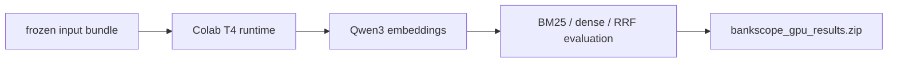

# BankScope Colab GPU evaluation

**Status:** active reproducible compute workflow, not application runtime.

Open `BankScope_GPU_Evaluation_Colab.ipynb` in Google Colab, select a T4 GPU
runtime, and run the notebook from top to bottom. When prompted, upload
`bankscope_colab_gpu_bundle.zip`.

The bundle intentionally contains only the frozen inputs and active code needed
to generate Qwen3 embeddings and evaluate BM25, dense, and RRF hybrid retrieval:

- `scripts/embed.py` and `scripts/evaluate.py`;
- the active `src/bankscope/` package;
- `data/processed/chunks.jsonl`, `tables.jsonl`, and `manifest.json`;
- `data/evaluation/queries.jsonl`;
- the repository README and parser/overhaul decision records.

The notebook does not require OpenAI or Hugging Face credentials. Its final cell
downloads `bankscope_gpu_results.zip`, containing `embeddings.npz`, the complete
retrieval result, input contracts, and environment/hash provenance.

The notebook is structurally validated locally, but its embedding and evaluation
cells must be executed on Colab because the development machine has no CUDA GPU.

The bundle must not include secrets, local chat state, or Qdrant storage. If a corpus or evaluator
contract changes, rebuild the bundle and update the notebook's documented hashes together. Keep
cell output small in Git; downloaded result archives belong in ignored `artifacts/`.

[Repository guide](../README.md) · [Evaluation data](../data/evaluation/README.md)
