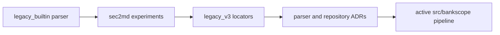

# Sandbox

**Status:** historical archive; excluded from the active runtime and Ruff gate.

Nothing under this directory is part of the active BankScope pipeline.
It is kept only so the project history can be reviewed without leaving old
entry points mixed with current code.

- `legacy_builtin/`: the original BeautifulSoup parser, table chunker and
  deterministic table-proxy pipeline.
- `legacy_v3/`: the larger sec2md row-locator pipeline and its evaluation
  history. It is the regression baseline for the overhaul.
- `experiments/`: completed notebooks and Docling, XBRL and JPM bake-off
  experiments, including the early project scaffold.
- `local_data/`: ignored, machine-local generated artifacts from before the
  overhaul. These files are not intended for Git.
- `docs/`: an earlier roadmap retained for historical context.

Archived code can contain obsolete paths, dependencies and assumptions. Do
not import it from active code or use its commands without an explicit review.

The archive retains source, small evaluation evidence, manifests, and concise findings. Large raw
downloads and derived experiment payloads are intentionally ignored and must be recreated from
the documented source URL and notebook/code when needed.

[Repository guide](../README.md) · [Completed experiments](experiments/README.md) ·
[Archived documents](docs/README.md)
