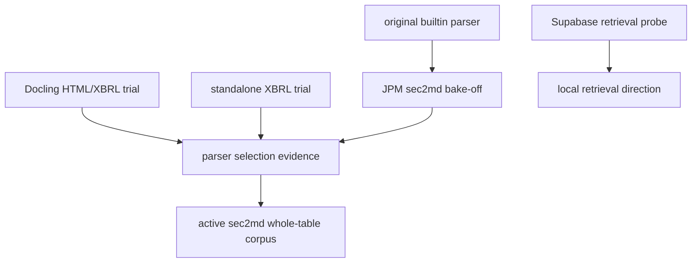

# Completed experiments

**Status:** historical evidence, never imported by the active project.

These files document approaches that are outside the active project:

- the JPM sec2md builtin-versus-structure-aware bake-off;
- Docling HTML/XBRL conversion trials;
- standalone XBRL conversion data;
- Colab and local exploratory notebooks.

They are not runtime dependencies and may contain absolute local paths or old
package assumptions.

## Preserved experiment groups

| Area | Preserved value | Guide |
|---|---|---|
| `jpm_sec2md_data/` | Manifest, queries, qrel audit, parser Markdown, and summarized bake-off | [JPM bake-off](jpm_sec2md_data/README.md) |
| `docling_jpm/` | Reproduction notes; raw and converted payloads are ignored | [Docling trial](docling_jpm/README.md) |
| `xbrl_data/` | Small standalone taxonomy fixture | This page |
| `supabase_retrieval/` | SQL, evaluator, small result, and local dependency note | [Supabase trial](supabase_retrieval/README.md) |
| `notebooks_legacy/` | Exploratory code/Markdown with committed outputs cleared | This page |
| `early_scaffold/` | Earliest project setup smoke tests | [Scaffold note](early_scaffold/README.md) |

Archived notebooks retain code and Markdown but not bulky execution output or execution counts.
Do not treat old absolute paths, package versions, or result formats as current contracts.

[Sandbox guide](../README.md) · [Decision records](../../docs/decisions/README.md)
