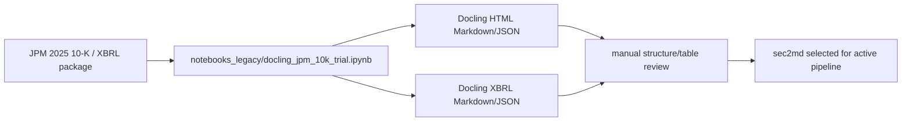

# JPM Docling HTML/XBRL trial

**Status:** completed parser experiment; raw inputs and converted outputs are regenerable and
ignored.

This experiment compared Docling conversion of JPMorgan Chase's 2025 10-K primary HTML with its
XBRL package. It tested whether a general document converter or XBRL path produced cleaner
structure and tables than the sec2md candidates used by BankScope.

## Reproduction record

- Filing: JPMorgan Chase & Co., report date `2025-12-31`, filed `2026-02-13`.
- Accession: `0001628280-26-008131`.
- Primary document: `jpm-20251231.htm` from SEC EDGAR.
- Reproduction workflow: `../notebooks_legacy/docling_jpm_10k_trial.ipynb`.
- Expected local locations: `source/` for SEC inputs and `output/html` / `output/xbrl` for
  conversions. All are ignored because they are large, derived, and reviewable from the notebook.

The experiment informed the parser comparison, but the active project chose pinned sec2md and a
whole-table corpus based on the recorded retrieval evidence. See ADR
[001](../../../docs/decisions/001-parser-selection.md) and ADR
[002](../../../docs/decisions/002-repository-overhaul.md).

[Completed experiments](../README.md)

