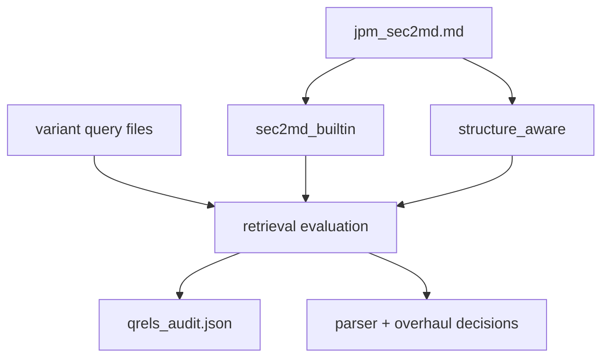

# JPM sec2md chunking bake-off

**Status:** completed experiment; small contracts are preserved and large derived JSONL is ignored.

The experiment compared sec2md's built-in chunking with a structure-aware row/cell locator design
on JPMorgan Chase's 2025 10-K.

## Preserved evidence

- `experiment_manifest.json`: SEC identity, parser/tokenizer versions, hashes, and record counts;
- `jpm_sec2md.md`: parsed source used by both variants;
- `qrels_audit.json`: reviewed target evidence for the comparison;
- `sec2md_builtin/queries.jsonl` and `structure_aware/queries.jsonl`: variant query contracts.

The manifest records `sec2md==0.1.23`, `Qwen/Qwen3-Embedding-0.6B`, 330 pages, and 350 table
parents. Built-in chunking produced 636 records, including 12 over the project token limit. The
structure-aware variant produced 3,657 eligible records, including 2,754 table locators and 226
glossary children. That locator volume motivated the simpler active design: one complete table plus
at most one compact retrieval description, with small lexical locators only for glossary tables.

Generated `chunks.jsonl`, `embedding_records.jsonl`, and `table_parents.jsonl` files are omitted.
Their expected hashes remain in the manifest so a deliberate reproduction can be checked. The
active result is recorded in ADR [001](../../../docs/decisions/001-parser-selection.md) and ADR
[002](../../../docs/decisions/002-repository-overhaul.md).

[Completed experiments](../README.md)

