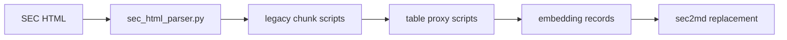

# Legacy builtin pipeline

**Status:** superseded parser implementation; historical reference only.

This directory contains the superseded local BeautifulSoup SEC parser and the
scripts that parsed elements, split tables, generated table proxies and
prepared embedding records.

It was archived because the validated sec2md corpus produced better hybrid
retrieval results and avoided splitting a source table into multiple evidence
objects. The files are historical reference material only.

Nothing in the active package imports this code. See
[ADR 001](../../docs/decisions/001-parser-selection.md) for the measured replacement decision.
