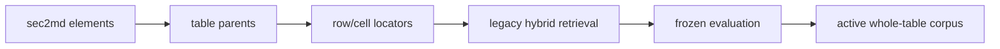

# Legacy sec2md v3 pipeline

**Status:** superseded structure-aware retrieval baseline; historical reference only.

This directory preserves the structure-aware sec2md v3 implementation, its
row/cell locator approach and the frozen evaluation history used to select
sec2md over the original parser.

The v3 corpus improved retrieval, but created 16,419 locator records for 1,783
tables and included a reranker that reduced the measured result. The active
pipeline therefore keeps sec2md parsing while replacing locators with one
whole-table record plus one compact description per relevant table.

The frozen result remains useful regression evidence, but its source, scripts, tests, and output
schemas are not active interfaces. See
[ADR 002](../../docs/decisions/002-repository-overhaul.md).
