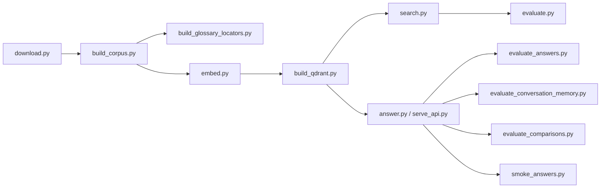

# Command-line entry points

**Status:** active user and evaluation workflows.

Scripts are thin orchestration layers over `src/bankscope`. Run them from the repository root after
activating `.venv`; use `python scripts/<name>.py --help` for the complete option list.



## Build and data commands

| Script | Purpose | Primary inputs → outputs |
|---|---|---|
| `download.py` | Resolve latest configured 10-Ks and download atomically | registry + SEC → raw HTML + `filings.json` |
| `build_corpus.py` | Parse filings, build chunks/tables/locators, and record provenance | manifest + raw HTML → processed JSONL + manifest |
| `build_glossary_locators.py` | Regenerate only lexical glossary locators | chunks + tables → locator JSONL |
| `embed.py` | Encode ordered retrieval text and validate lengths | chunks → `embeddings.npz` |
| `build_qdrant.py` | Validate and import dense/sparse records into local Qdrant | corpus + embeddings + banks → Qdrant + manifest |

Table descriptions are deterministic by default. `build_corpus.py --description-mode openai` is an
explicit, paid enrichment mode that performs one model request per eligible table. Filtered corpus
builds must use their own `--output-dir`. `embed.py --limit N` is a no-write smoke check.

## Query and service commands

| Script | Purpose | Notes |
|---|---|---|
| `search.py` | Inspect dense, BM25, or hybrid retrieval | Supports `baseline`, `qdrant`, and accepted `mixed` backends |
| `answer.py` | Run one single-bank or bounded comparison question | Uses the reusable long-lived pipeline for one CLI request |
| `serve_api.py` | Load services once and run FastAPI/Uvicorn | Defaults to local SQLite and the validated UI model candidate |
| `smoke_qdrant.py` | Exercise a small local Qdrant query | BM25 works without constructing a query embedding |
| `smoke_answers.py` | Run the fixed ten-bank application-answer smoke | Requires the configured generation API and local mixed retriever |

Examples:

```powershell
python scripts/search.py "operational risk capital" --backend mixed --mode hybrid --ticker JPM
python scripts/answer.py "Compare the CET1 ratios of JPMorgan Chase and Bank of America."
python scripts/serve_api.py --host 127.0.0.1 --port 8000
```

## Evaluation and diagnostic commands

| Script | Purpose |
|---|---|
| `evaluate.py` | Frozen retrieval metrics, backend comparisons, parity, and quality gates |
| `evaluate_answers.py` | Single-bank deterministic metrics and optional semantic judge |
| `evaluate_conversation_memory.py` | Follow-up rewrite and retrieval gate with isolation controls |
| `evaluate_comparisons.py` | Evidence-group, semantic, and citation-ownership checks |
| `smoke_answers.py` | Ten-bank supported-answer and citation-ownership smoke |
| `benchmark_query_embeddings.py` | Warm-up and repeated query-encoder latency measurement |
| `probe_generation_json.py` | Small gateway JSON-mode compatibility probe |
| `export_logo_from_ai.mjs` | Deterministically export canonical and public SVG brand assets |

Evaluation commands may make model calls and create ignored reports. Do not rerun a frozen live
baseline without explicit intent; use `--skip-judge`, `--query-id`, or smoke limits where supported.

## Failure and safety rules

- Missing, stale, or mismatched artifacts abort rather than falling back silently.
- `build_qdrant.py --recreate` intentionally replaces the configured collection.
- Stop other BankScope processes before opening persistent local Qdrant.
- Never commit `.env`, generated corpora/indexes, local chat databases, or result directories.
- Add reusable validation to `src/bankscope`, not a second implementation inside a script.

When changing a command, update this table, its `--help`, tests, and every README command example.

[Repository guide](../README.md) · [Package architecture](../src/bankscope/README.md)
