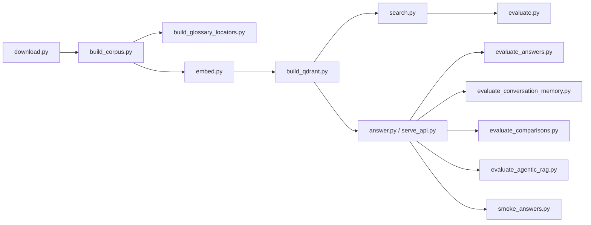

# Command-line entry points

**Status:** active user and evaluation workflows.

Scripts are thin orchestration layers over `src/bankscope`. Run them from the repository root after
activating `.venv`; use `python scripts/<name>.py --help` for the complete option list.



## Build and data commands

| Script | Purpose | Primary inputs → outputs |
|---|---|---|
| `download.py` | Resolve latest configured 10-Ks and download atomically | registry + SEC → raw HTML + `filings.json` |
| `build_corpus.py` | Parse filings, build chunks/tables/locators, and record provenance | manifest + raw HTML → processed JSONL + manifest |
| `build_glossary_locators.py` | Regenerate only lexical glossary locators | chunks + tables → locator JSONL |
| `embed.py` | Encode ordered retrieval text and validate lengths | chunks → `embeddings.npz` |
| `build_qdrant.py` | Validate and import dense/sparse records into local Qdrant | corpus + embeddings + banks → Qdrant + manifest |

Table descriptions are deterministic by default. `build_corpus.py --description-mode openai` is an
explicit, paid enrichment mode that performs one model request per eligible table. Filtered corpus
builds must use their own `--output-dir`. `embed.py --limit N` is a no-write smoke check.

## Query and service commands

| Script | Purpose | Notes |
|---|---|---|
| `search.py` | Inspect dense, BM25, or hybrid retrieval | Supports `baseline`, `qdrant`, and accepted `mixed` backends |
| `answer.py` | Run one single-bank or bounded comparison question | Uses the reusable long-lived pipeline for one CLI request |
| `serve_api.py` | Load services once and run FastAPI/Uvicorn | Uses configured `OPENAI_MODEL`, local SQLite, optional OpenAI/Tavily web search, and CLI model override |
| `smoke_qdrant.py` | Exercise a small local Qdrant query | BM25 works without constructing a query embedding |
| `smoke_answers.py` | Run the fixed ten-bank application-answer smoke | Requires the configured generation API and local mixed retriever |

Examples:

```powershell
python scripts/search.py "operational risk capital" --backend mixed --mode hybrid --ticker JPM
python scripts/answer.py "Compare the CET1 ratios of JPMorgan Chase and Bank of America."
python scripts/serve_api.py --host 127.0.0.1 --port 8000
```

## Evaluation and diagnostic commands

| Script | Purpose |
|---|---|
| `evaluate.py` | Frozen retrieval metrics, backend comparisons, parity, and quality gates |
| `evaluate_answers.py` | Single-bank deterministic metrics and optional semantic judge |
| `evaluate_conversation_memory.py` | Follow-up rewrite and retrieval gate with isolation controls |
| `evaluate_comparisons.py` | Evidence-group, semantic, and citation-ownership checks |
| `evaluate_agentic_rag.py` | Compare retrieval-only baseline/agentic runs on the 12-question challenge, record nested end-to-end results, and enforce rollout gates |
| `smoke_answers.py` | Ten-bank supported-answer and citation-ownership smoke |
| `benchmark_query_embeddings.py` | Warm-up and repeated query-encoder latency measurement |
| `probe_generation_json.py` | Small gateway JSON-mode compatibility probe |
| `export_logo_from_ai.mjs` | Deterministically export canonical and public SVG brand assets |

Evaluation commands may make model calls and create ignored reports. Do not rerun a frozen live
baseline without explicit intent; use `--skip-judge`, `--query-id`, or smoke limits where supported.

### Enable and test bounded agentic RAG

For the local application, edit the repository `.env`:

```dotenv
AGENTIC_RAG_ENABLED=true
```

For a one-session PowerShell override without editing `.env`:

```powershell
$env:AGENTIC_RAG_ENABLED = "true"
.\start-app.ps1
```

Stop the existing API process before restarting it because embedded Qdrant has one local owner and
settings are cached for the process lifetime:

```powershell
.\start-app.ps1
```

Open a response's collapsed **Diagnostics** panel and verify `Agentic RAG: enabled`, the route, the
per-bank loop outcome and trace, model/tool/verifier request counts, and execution checks. To
disable the feature, restore `AGENTIC_RAG_ENABLED=false` and restart the API.

Run the live acceptance comparison only after the existing frozen gates pass:

Use `python scripts/evaluate_comparisons.py --repetitions 3` when checking intermittent multi-bank
`partial` results. Every frozen comparison is rerun independently and the report records per-query
stability in addition to evidence coverage and citation ownership.

```powershell
python scripts/evaluate_agentic_rag.py --prerequisite-gates-passed
```

Evaluate the LangGraph conversation router separately from retrieval and answer generation:

```powershell
python scripts/evaluate_conversation_routing.py
```

This writes `data/evaluation/results/conversation-routing-v1.json` and exits non-zero if supported
bank recall, general-chat no-retrieval behavior, overall route accuracy, or rewrite scope
preservation misses its acceptance threshold. The fixture includes direct benign chat, web-worthy
current questions, and deterministic calculation.

The evaluator toggles baseline/agentic mode internally, obtains authoritative retrieval evidence
through `retrieve_evidence()`, writes `data/evaluation/results/agentic-rag-v1.json`, and exits
non-zero unless every rollout check passes. The gate preserves baseline Top 5 and counts recovery
only when a genuine baseline Top-10 miss becomes an agentic Top-10 hit. End-to-end generation is recorded
separately in the same report. It defaults to the same `AZURE_GPT_51_2025_1113` candidate as
`serve_api.py`; use `--model` only for an explicit comparison. Passing it does not change the
production default automatically.

## Failure and safety rules

- Missing, stale, or mismatched artifacts abort rather than falling back silently.
- `build_qdrant.py --recreate` intentionally replaces the configured collection.
- Stop other BankScope processes before opening persistent local Qdrant.
- Never commit `.env`, generated corpora/indexes, local chat databases, or result directories.
- Add reusable validation to `src/bankscope`, not a second implementation inside a script.

When changing a command, update this table, its `--help`, tests, and every README command example.

[Repository guide](../README.md) · [Package architecture](../src/bankscope/README.md)
