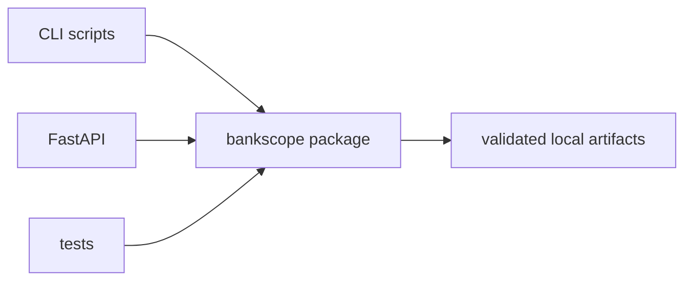

# Python source layout

**Status:** active application source.

The project uses the packaging `src` layout configured in `pyproject.toml`. The importable package
is `bankscope`, while user-facing commands remain in the repository-level `scripts/` folder.

```text
src/
└── bankscope/
    ├── api.py
    ├── io.py
    ├── chat/
    ├── config/
    ├── evaluation/
    ├── generation/
    ├── llm/
    ├── parsing/
    ├── retrieval/
    └── sec/
```



Keeping application code below `src` prevents accidental imports from the repository root and
makes tests exercise the same installed package used by scripts. Install it in editable mode with
`python -m pip install -e ".[dev,llm]"`.

Agentic RAG orchestration lives in `bankscope/generation/agentic.py` and is composed by the
long-lived answer pipeline. The module owns the discriminated actions, per-bank state, verifier
verdict, and bounded loop contracts; `BankAnswerPipeline.retrieve_evidence()` returns the reusable
`RetrievalRun` consumed by both answer generation and retrieval-only evaluation. It remains
application logic rather than a script-only experiment; the command-line evaluator in `scripts/`
only drives the reusable package implementation.

`bankscope/generation/query_planner.py` owns referential-only memory selection, per-bank comparison
decomposition, and section-diverse whole-filing summary queries. Agentic retrieval remains an
additive, disabled-by-default extension of those deterministic boundaries.

Do not place generated files, CLI-only orchestration, or archived experiments here. See the
[package architecture](bankscope/README.md) and [script guide](../scripts/README.md).

[Back to repository guide](../README.md)
