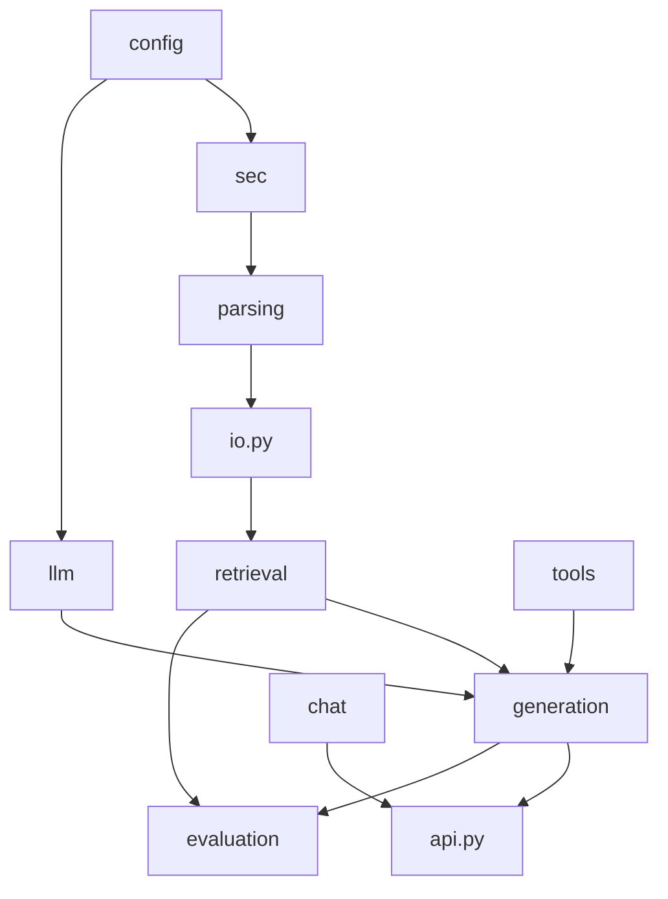

# BankScope Python package

**Status:** active reusable application logic.

`bankscope` owns validation, parsing, retrieval, answer generation, local chat state, API contracts,
and evaluation primitives. Scripts compose this package but should not duplicate its business
rules.

## Modules and packages

| Area | Responsibility | Guide |
|---|---|---|
| `api.py` | FastAPI request models, routes, SSE formatting, and error mapping | This page |
| `io.py` | Atomic JSONL, hashing, and embedding archive validation | This page |
| `chat/` | SQLite threads and canonical citation reopening | [Chat guide](chat/README.md) |
| `config/` | Environment-backed application settings | [Config guide](config/README.md) |
| `evaluation/` | Retrieval and answer metrics plus semantic judge | [Evaluation guide](evaluation/README.md) |
| `generation/` | Contextualization, grounded answers, comparisons, and orchestration | [Generation guide](generation/README.md) |
| `llm/` | OpenAI-compatible client construction | [LLM guide](llm/README.md) |
| `parsing/` | sec2md element, narrative, and complete-table processing | [Parsing guide](parsing/README.md) |
| `retrieval/` | Dense, BM25S, Qdrant, RRF, and hydration | [Retrieval guide](retrieval/README.md) |
| `sec/` | Bank registry and deterministic bank resolution | [SEC guide](sec/README.md) |
| `tools/` | Safe Decimal calculation and provider-neutral cited web search | [ADR 015](../../docs/decisions/015-general-chat-web-and-calculator.md) |

## API surface

`api.py` exposes `QuestionRequest`, `ThreadRequest`, `RenameThreadRequest`, `AppServices`, and
`create_app()`. The resulting application provides:

| Method and route | Behavior |
|---|---|
| `GET /api/health` | Service readiness |
| `GET/POST /api/threads` | List or create local threads |
| `GET /api/threads/{id}/messages` | Load a thread and grouped turns |
| `PATCH/DELETE /api/threads/{id}` | Rename or delete a thread |
| `POST /api/threads/{id}/answers` | Non-streaming persistent answer turn |
| `POST /api/threads/{id}/stream` | SSE status events followed by answer/error and done |
| `GET /api/citations/{id}/context` | Resolve current canonical source context |
| `POST /api/answer` | Stateless compatibility endpoint |

`QuestionRequest` trims questions, normalizes an optional ticker, and deduplicates ordered tickers.
`AppServices` combines the answer pipeline, chat store, source resolver, and model name without
making them globals. Answer and error turns may include optional `diagnostics`. SSE status events
are flushed immediately, include heartbeat comments during long work, and can add repeatable
`assessing_evidence` progress to the baseline stages; the terminal
diagnostics contain each hybrid/exact search, context read, verifier verdict, budget count, and
schema-recovery event.

Standard filing answers may also include optional `evidence_audit`. It is persisted with the turn
before response delivery and is advisory; `unavailable` never changes the answer's status or HTTP
behavior. Historical turns without the field remain valid.

When `AGENTIC_RAG_ENABLED=true`, `BankAnswerPipeline.retrieve_evidence()` performs initial hybrid
retrieval and then an isolated additive bounded loop for each bank. Runtime, not the model, supplies ticker,
accession, backend, windows, and limits. Calculator and web providers are internal conversational
tools rather than public generic execution endpoints. Citation context discriminates local filing
evidence from validated external web URLs.

## Shared I/O functions

- `read_jsonl()` reports the exact invalid line and requires JSON objects.
- `write_jsonl()` writes UTF-8 through a temporary sibling and atomically replaces the target.
- `sha256_file()` streams files rather than loading them whole.
- `load_embedding_archive()` validates required keys, `float32` finite unit vectors, dimensions,
  unique ordered IDs, model metadata, and the source chunks hash.

These checks intentionally reject stale or partly written artifacts. Do not weaken them to make a
bad local artifact open successfully.

## When changing this area

1. Keep scripts thin and reusable rules in the package.
2. Preserve response fields consumed by `frontend/src/api.ts` or update both sides and their tests.
3. Preserve fail-closed provenance and source-hydration behavior.
4. Update the closest package README and add an ADR for measured architecture changes.
5. Run the complete Python and frontend test suites for API or cross-package changes.

[Python layout](../README.md) · [Repository guide](../../README.md)
