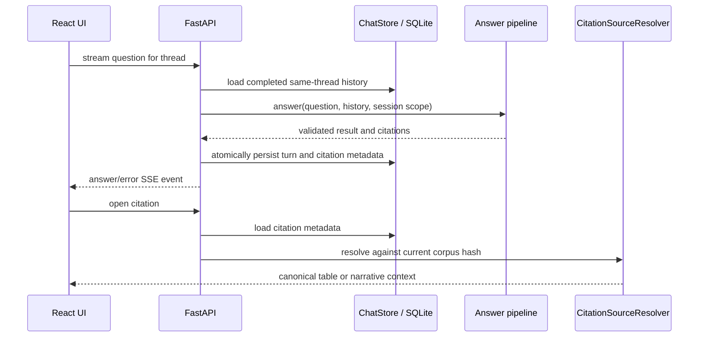

# Conversation state and citation sources

**Status:** active local persistence layer.

## Files and public API

| File | Public symbols | Responsibility |
|---|---|---|
| `store.py` | `ChatStore` | Initialize/migrate schema; manage threads; group turns; bound history; atomically persist answer/error turns; load citations |
| `sources.py` | `CitationSourceResolver`, `StaleCitationError` | Index corpus targets and reopen canonical narrative or complete-table evidence |

`ChatStore` exposes thread CRUD, `list_messages()`, `list_turns()`, bounded
`conversation_history()`, `append_answer_turn()`, `append_error_turn()`, and `get_citation()`.
Successful turns update the server-owned single/comparison bank scope. Error turns do not enter
contextualization history. Both successful and failed assistant messages store their diagnostics in
the existing `payload_json`; no agentic-specific SQLite table or schema migration is required.
Error turns expose `failed_stage` and a stable error code when available.

`CitationSourceResolver.context()` validates the citation's corpus hash. Text citations return an
anchor plus neighboring narrative chunks; table citations return the complete table. Stale or
missing targets fail closed.

## Invariants and changes

- SQLite transactions keep each user/assistant turn and its citations consistent.
- History is thread-isolated, bounded, chronological, and limited to completed turns.
- Stored assistant text may clarify a follow-up but is never evidence.
- SQLite stores citation metadata, not a second canonical corpus.
- Runtime execution checks are persisted for observability but do not claim factual correctness.

Run `tests/test_chat_store.py`, `tests/test_chat_sources.py`, contextualizer tests, and frontend API
tests after changes.

[Package architecture](../README.md) · [Local data](../../../data/local/README.md)
