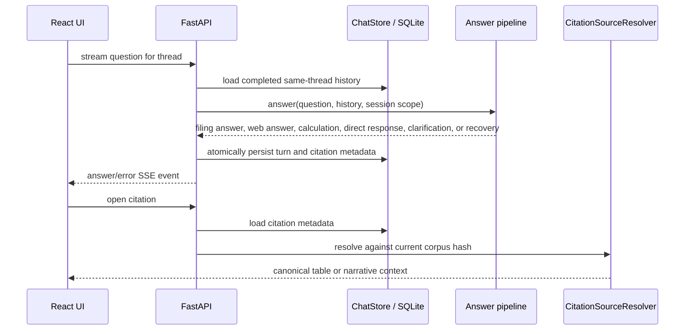

# Conversation state and citation sources

**Status:** active local persistence layer.

## Files and public API

| File | Public symbols | Responsibility |
|---|---|---|
| `store.py` | `ChatStore` | Initialize/migrate schema; manage threads; group turns; bound history; atomically persist answer/error turns; load citations |
| `sources.py` | `CitationSourceResolver`, `StaleCitationError` | Index corpus targets and reopen canonical narrative or complete-table evidence |

`ChatStore` exposes thread CRUD, `list_messages()`, `list_turns()`, bounded
`conversation_context()`, `conversation_history()`, summary checkpoints, turn persistence, and
`get_citation()`.
Answered filing turns update the server-owned single/comparison bank scope. Direct responses,
clarifications, and recovery turns retain the existing scope. Every threaded request receives the
available raw history. Once summary plus transcript exceed 12,000 estimated tokens, older complete
pairs are compacted into a thread-scoped summary and at least six newest pairs stay verbatim.
Expected model and pipeline failures are stored as normal answered `retryable_error` turns, so the
user receives a visible response and may retry or continue. Their generic assistant boilerplate is
excluded from semantic model context so it cannot reinforce a later model failure. Up to three
trailing failed user requests are exposed separately as `unresolved_requests`, allowing a later
"retry" to recover the real question. Retry-only phrases and duplicate resubmissions do not replace
that canonical target; acknowledgements and clarifications preserve it. The store scans backward
for the latest substantive filing, web, calculation, or general-chat answer, so an acknowledgement
does not break a later transform. The API
holds the generation lock from context loading through persistence, preventing concurrent turns
from sharing a stale memory snapshot.
The older error-turn contract remains available for infrastructure-level failures. Diagnostics live in the existing
`payload_json`; no agentic-specific SQLite table or schema migration is required.

`CitationSourceResolver.context()` validates the citation's corpus hash. Text citations return an
anchor plus neighboring narrative chunks; table citations return the complete table. Stale or
missing targets fail closed. Web citations persist as `kind=web` with a validated HTTP(S) URL and
open externally; they do not pretend to be members of the local filing corpus.

## Invariants and changes

- SQLite transactions keep each user/assistant turn and its citations consistent.
- History is thread-isolated, chronological, token-bounded, and contains complete raw pairs after
  the current summary checkpoint.
- The previous grounded answer may be transformed using its existing citation labels, but neither
  raw history nor the summary is evidence for a new filing claim.
- The original current message is authoritative; a contextualized search query is disposable.
- SQLite stores citation metadata, not a second canonical corpus.
- Runtime execution checks are persisted for observability but do not claim factual correctness.

Run `tests/test_chat_store.py`, `tests/test_chat_sources.py`, contextualizer tests, and frontend API
tests after changes.

[Package architecture](../README.md) · [Local data](../../../data/local/README.md)
