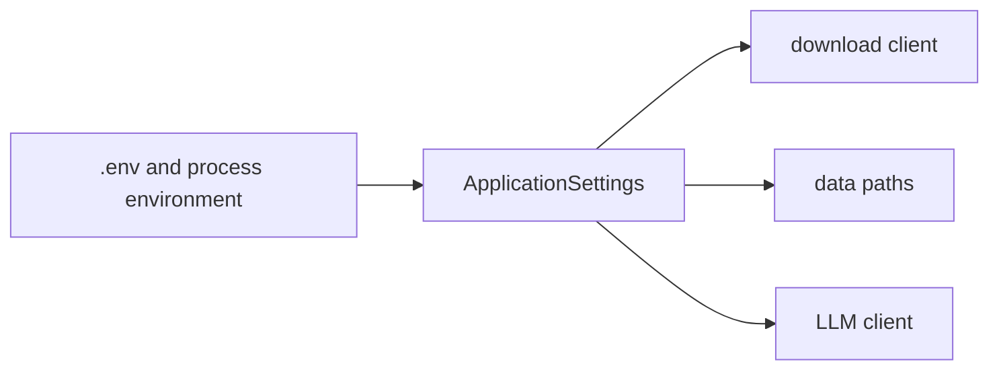

# Runtime settings

**Status:** active configuration adapter.

`settings.py` centralizes environment-backed configuration with Pydantic Settings.

## Public API

| Symbol | Contract |
|---|---|
| `ApplicationSettings` | Typed SEC identity/rate, registry/raw paths, and optional model credentials |
| `get_settings()` | Cached process-wide settings instance |

The SEC user agent must include an email address and the request rate must remain positive and no
greater than the SEC limit enforced by the model. Secrets use `SecretStr` to reduce accidental
logging. `.env.example` is documentation; `.env` is local and ignored.

When adding a setting, give it a safe default where possible, add it to `.env.example` when users
must know it, and cover validation/caching in `tests/test_settings.py`.

[Package architecture](../README.md) · [Static configuration](../../../config/README.md)

