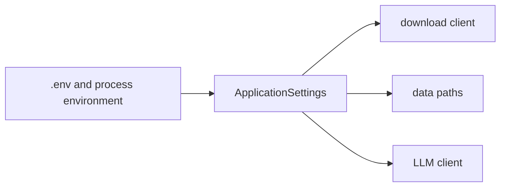

# Runtime settings

**Status:** active configuration adapter.

`settings.py` centralizes environment-backed configuration with Pydantic Settings.

## Public API

| Symbol | Contract |
|---|---|
| `ApplicationSettings` | Typed SEC identity/rate, registry/raw paths, and optional model credentials |
| `get_settings()` | Cached process-wide settings instance |

The SEC user agent must include an email address and the request rate must remain positive and no
greater than the SEC limit enforced by the model. Secrets use `SecretStr` to reduce accidental
logging. `.env.example` is documentation; `.env` is local and ignored.

`AGENTIC_RAG_ENABLED` is a boolean rollout flag with the safe default `false`. Settings are cached
and the pipeline is constructed once, so changing the value requires an API restart. For a local
session, either set `AGENTIC_RAG_ENABLED=true` in `.env` or set the process environment before
starting BankScope; process environment values take precedence over `.env`.

`CONVERSATION_ROUTER_BACKEND` defaults to `langgraph`. The temporary `legacy` value bypasses graph
execution but retains the same strict route schema, validation policy, and non-veto fallback; it is
intended only as a short-lived rollback switch while the LangGraph path is stabilized.

When adding a setting, give it a safe default where possible, add it to `.env.example` when users
must know it, and cover validation/caching in `tests/test_settings.py`.

[Package architecture](../README.md) · [Static configuration](../../../config/README.md)
