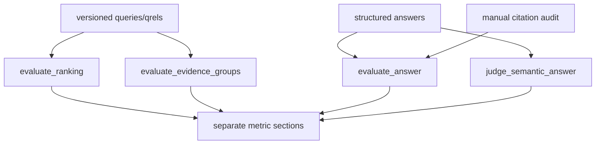

# Evaluation primitives

**Status:** active metric and advisory-judge library.

## Files and public API

| File | Public symbols | Responsibility |
|---|---|---|
| `retrieval_metrics.py` | `deduplicate_ids()`, `evaluate_ranking()`, `evaluate_evidence_groups()` | Hit/rank/MRR and grouped multi-bank evidence coverage |
| `answer_metrics.py` | `expected_answer_status()`, `evaluate_answer()`, `summarize_answer_metrics()` | Deterministic status, entity, value, unit, period, and citation metrics |
| `semantic_judge.py` | `SemanticJudgement`, `judge_semantic_answer()` | Optional correctness/completeness/groundedness judgement over cited evidence only |

Deterministic metrics are authoritative for schema and exact contractual checks. The semantic judge
is advisory, versioned, and receives only evidence cited by the candidate answer. Structured facts
are preferred; text fallback exists only for historical baselines.

Retrieval, single-bank generation, conversation memory, and multi-bank comparison use distinct
denominators and reports. Do not combine them into one quality score or silently exclude errors.
Metric changes require matching tests and an update to the relevant ADR/report.

The agentic evaluator is an orchestration gate built from these existing contracts rather than a
new factual metric. It calls `BankAnswerPipeline.retrieve_evidence()` so baseline/agentic Hit@5/10
and recovered misses are measured independently of answer-generation schema reliability. It also
records routes, per-bank loop traces and verifier verdicts, model/tool requests, available token
usage, latencies, citations, and runtime execution checks. End-to-end generation remains nested in
the report as a separate gate; its failure does not erase a valid retrieval result. Qrels remain
the only basis for claims about retrieval/factual recovery.

[Evaluation data](../../../data/evaluation/README.md) · [CLI evaluators](../../../scripts/README.md)
