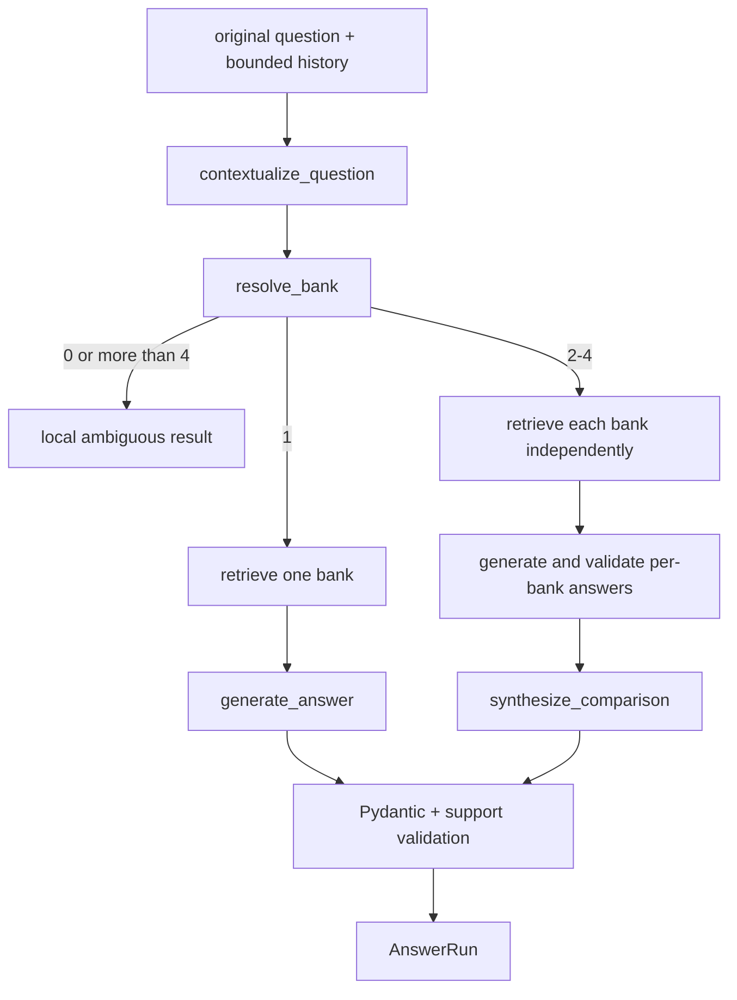

# Grounded answer generation

**Status:** active single-bank, conversational, and comparison orchestration.

## Files

| File | Public symbols | Responsibility |
|---|---|---|
| `pipeline.py` | `QueryEncoder`, `SentenceTransformerQueryEncoder`, `AnswerRun`, `BankAnswerPipeline`, `SingleBankAnswerPipeline` | Load long-lived services and orchestrate contextualization, scope, retrieval, generation, and comparisons |
| `answer_generator.py` | `NumericFacts`, `ModelAnswer`, `GenerationValidationError`, `generate_answer()` | Build evidence payload, request JSON, validate citations/facts, and render supported or abstaining answers |
| `contextualizer.py` | `StandaloneQuestion`, `ContextualizationResult`, `contextualize_question()` | Rewrite a follow-up from bounded clean history while preserving the original question |
| `comparison_generator.py` | `ComparisonClaim`, `ComparisonSynthesis`, `synthesize_comparison()` | Validate a final synthesis over already validated, bank-owned results |

## Answer contracts

`BankAnswerPipeline.from_paths()` validates the Qdrant/corpus relationship once and builds reusable
retrieval and encoder services. `answer()` accepts the original question, optional session scope,
history, retrieval filters, and limits. It returns `AnswerRun`, which includes the response and
retrieval/contextualization diagnostics.

Numeric model output must provide entity, metric, optional variant, period, exact value text, unit,
and citation IDs. Numeric answers are rendered locally, and the canonical numeric token must occur
in cited evidence. Narrative answers still require owned citations. Missing periods, invalid JSON,
unknown citations, cross-bank citations, or insufficient support produce a controlled error or
abstention rather than an invented answer.

For comparisons, each bank is retrieved and generated independently. Final synthesis sees
structured bank results, not a mixed evidence pool. Status is `partial` when at least one selected
bank is unsupported; citation ownership remains tied to its bank result. Partial comparisons skip
the synthesis model and deterministically state which banks lack evidence before presenting the
already validated supported bank answers. This prevents a synthesis from implying a relationship
between banks when one side has no grounded result.

## Model calls and failure modes

- Contextualization is skipped when there is no usable history.
- Single-bank generation makes at most one answer request and does not retry.
- A fully supported comparison adds one synthesis request after its per-bank calls; partial and
  fully unsupported comparisons do not.
- Model-specific request options are explicit; responses pass strict Pydantic validation.
- Unsupported requested years can fail before a model call.

Changes require generator, pipeline, contextualizer, comparison, evaluator, and frontend contract
tests plus the relevant frozen live gate before a default changes.

[Package architecture](../README.md) · [Evaluation](../evaluation/README.md)
