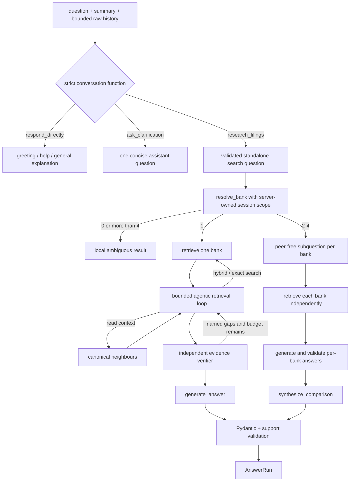

# Grounded answer generation

**Status:** active single-bank, conversational, and comparison orchestration.

## Files

| File | Public symbols | Responsibility |
|---|---|---|
| `conversation.py` | `ConversationGraph`, `RouteDecision`, execution argument models | Run the once-compiled LangGraph semantic router, validate source policy, and fail over to the bounded deterministic policy |
| `memory.py` | `ConversationSummary`, `summarize_conversation()` | Compact old complete pairs while retaining user preferences and referents without treating history as evidence |
| `agentic.py` | `AgentStep`, `AgentState`, `EvidenceVerdict`, `CanonicalContextExpander` | Strict native retrieval tools, loop state, evidence verification, scope validation, and bounded context reads |
| `pipeline.py` | `QueryEncoder`, `RetrievalRun`, `AnswerRun`, `BankAnswerPipeline` | Load services and orchestrate retrieval-only runs, generation, and comparisons |
| `answer_generator.py` | `NumericFacts`, `ModelAnswer`, `GenerationValidationError`, `generate_answer()` | Build evidence payload, require a strict answer function call, validate citations/facts, and render supported or abstaining answers |
| `contextualizer.py` | `StandaloneQuestion`, `ContextualizationResult`, `contextualize_question()` | Rewrite a follow-up from bounded clean history while preserving the original question |
| `query_planner.py` | `build_bank_subquestion()`, `build_retrieval_queries()` | Validate rewrites, decompose comparisons, and diversify full-filing summaries |
| `comparison_generator.py` | `ComparisonClaim`, `ComparisonSynthesis`, `synthesize_comparison()` | Validate a final synthesis over already validated, bank-owned results |

## Answer contracts

`BankAnswerPipeline.from_paths()` validates the Qdrant/corpus relationship once and builds reusable
retrieval and encoder services. `answer()` accepts the original question, optional session scope,
history, retrieval filters, and limits. It returns `AnswerRun`, which includes the response and
retrieval/contextualization diagnostics. `retrieve_evidence()` returns a generation-independent
`RetrievalRun`; `AnswerRun` retains `diagnostics`, `stage_trace`, and per-bank agent traces.

Threaded API calls explicitly pass conversation history, including an empty history for a new
thread. That activates the conversational front door. CLI and compatibility callers that omit
history keep the direct domain-pipeline contract. Every threaded turn returns a `dialog_act`:
`answer`, `clarification`, a direct-conversation category, or `retryable_error`.

## Bounded agentic mode

The mode is controlled by `AGENTIC_RAG_ENABLED` and defaults to `false`. When enabled:

1. The conversation front door has already selected filing research; agentic mode does not decide
   whether a user deserves a response.
2. Existing Qdrant dense + BM25S + RRF runs first.
3. Each bank independently receives a loop of `search_hybrid`, `search_exact`, `read_context`, and
   `finish` actions. Search may add canonical English filing terms while preserving periods and
   rejecting new numeric facts.
4. Runtime-owned filters keep every action inside one ticker/accession. Exact search accepts only
   literal phrases; context reads accept only returned target IDs and at most three chunks per side.
5. The loop permits at most three orchestration requests, one tool action, and one independent
   verifier request per bank. Repeated actions return `No new evidence` and consume the budget.
6. Two consecutive schema failures end safely with current evidence or `unsupported`.

Agentic evidence is corrective and additive: validated baseline results remain first and cannot be
removed by an agent/verifier `unsupported` verdict. The feature remains disabled by default.

Conversation, final-answer, agent-step, and verifier decisions use OpenAI native function calling with
`tool_choice=required`, `parallel_tool_calls=false`, strict schemas, local Pydantic validation, and
a bounded timeout. Runtime owns ticker filters, record filters, result limits, canonical target
IDs, and tool budgets. No model tool accepts filesystem paths or shell access. Rewrite validation
preserves explicit years and numeric qualifiers and rejects facts absent from user-authored
context, preventing values from an earlier assistant answer from leaking into a new search query.

Numeric model output must provide entity, metric, nullable variant, period, exact value text, unit,
and citation IDs. Numeric answers are rendered locally, and the canonical numeric token must occur
in cited evidence. Narrative answers still require owned citations. Missing periods, invalid JSON,
unknown citations, cross-bank citations, or insufficient support produce a controlled error or
abstention rather than an invented answer.

For comparisons, the planner first removes every selected bank name from the topic and creates one
bank-owned question. Each question is embedded, retrieved, and generated independently. Final
synthesis sees structured bank results, not a mixed evidence pool. Status is `partial` when at
least one selected bank is unsupported; citation ownership remains tied to its bank result. Partial
comparisons skip the synthesis model and deterministically state which banks lack evidence before
presenting the already validated supported bank answers.

## Model calls and failure modes

- The conversational front door always receives available bounded context: a thread summary, raw
  messages after its checkpoint, and the previous grounded answer with allowed citation labels.
  Above 12,000 estimated tokens, older turns are summarized and the newest six pairs remain raw.
- A direct contextual transformation can shorten, reformat, simplify, or translate the previous
  grounded answer without retrieval. Runtime rejects new citations, numbers, banks, or qualifiers.
- A model-authored research rewrite is only an internal search query. The original user question
  remains authoritative; a rewrite that drops or adds bank, period, or numeric scope falls back to
  the original question instead of terminating the turn. Focused retrieval searches the validated
  rewrite, the original wording, and a deterministic bank-scoped concept query for operational
  risk, cybersecurity, third-party risk, or CET1 when applicable.
- Direct responses may handle any benign general request, even when a stale bank remains in thread
  scope, but cannot bypass filing research for a new supported-bank filing claim. Capability
  answers are rendered from the server-owned bank registry rather than model-authored bank names.
- Current/external questions may invoke cited web search; arithmetic may invoke the bounded
  Decimal calculator. Neither path runs filing retrieval.
- Single-bank generation selects one of four strict tools for supported numeric, supported
  narrative, ambiguous, or unsupported results. Truncation and contract-shape failures receive at
  most one repair retry; unsupported display text is server-rendered.
- The model handles normal conversation and vague-CET1 semantics; deterministic policy validates
  its source choice. Product-domain mismatch is not a refusal reason. One bank's validation failure
  cannot abort the remaining comparison banks.
- A fully supported comparison adds one synthesis request after its per-bank calls; partial and
  fully unsupported comparisons do not.
- Model-specific request options are explicit; responses pass strict Pydantic validation.
- Unsupported requested years can fail before a model call.
- Enabled agentic mode adds up to three bounded orchestration requests per bank; diagnostics expose
  every action, effective query, verifier verdict, fallback, latency, and budget check.
- Expected threaded pipeline/model failures are persisted as normal `retryable_error` assistant
  turns with diagnostics and HTTP 200. They remain visible and retryable in the UI but their
  server boilerplate is excluded from semantic model context. Infrastructure/API contract failures
  may still be errors.

Changes require generator, pipeline, contextualizer, comparison, evaluator, and frontend contract
tests plus the relevant frozen live gate before a default changes.

[Package architecture](../README.md) · [Evaluation](../evaluation/README.md)
