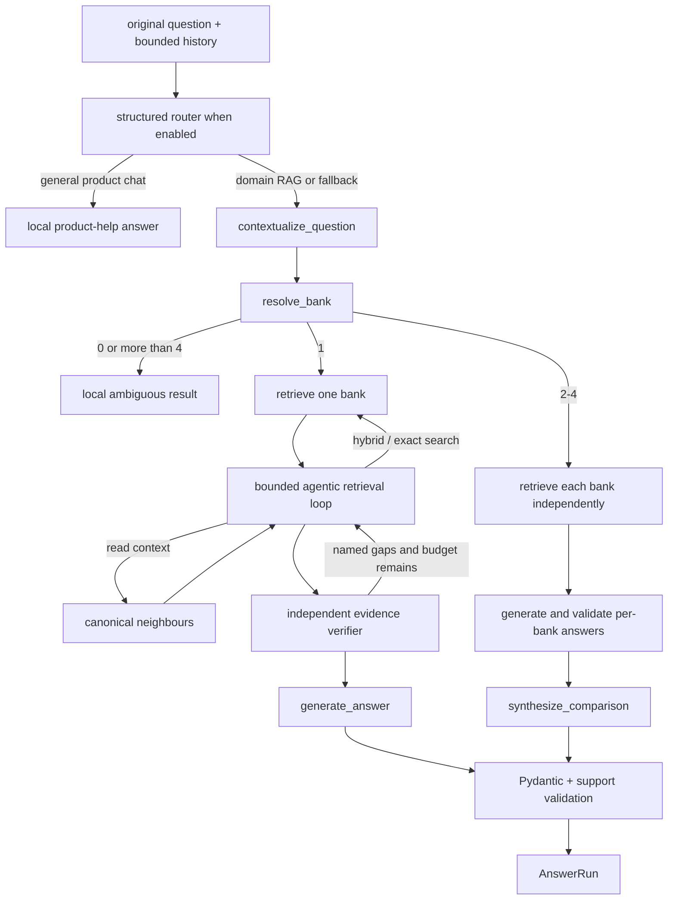

# Grounded answer generation

**Status:** active single-bank, conversational, and comparison orchestration.

## Files

| File | Public symbols | Responsibility |
|---|---|---|
| `agentic.py` | `AgentStep`, `AgentState`, `EvidenceVerdict`, `CanonicalContextExpander` | Strict JSON actions, loop state, evidence verification, scope validation, and bounded context reads |
| `pipeline.py` | `QueryEncoder`, `RetrievalRun`, `AnswerRun`, `BankAnswerPipeline` | Load services and orchestrate retrieval-only runs, generation, and comparisons |
| `answer_generator.py` | `NumericFacts`, `ModelAnswer`, `GenerationValidationError`, `generate_answer()` | Build evidence payload, request JSON, validate citations/facts, and render supported or abstaining answers |
| `contextualizer.py` | `StandaloneQuestion`, `ContextualizationResult`, `contextualize_question()` | Rewrite a follow-up from bounded clean history while preserving the original question |
| `comparison_generator.py` | `ComparisonClaim`, `ComparisonSynthesis`, `synthesize_comparison()` | Validate a final synthesis over already validated, bank-owned results |

## Answer contracts

`BankAnswerPipeline.from_paths()` validates the Qdrant/corpus relationship once and builds reusable
retrieval and encoder services. `answer()` accepts the original question, optional session scope,
history, retrieval filters, and limits. It returns `AnswerRun`, which includes the response and
retrieval/contextualization diagnostics. `retrieve_evidence()` returns a generation-independent
`RetrievalRun`; `AnswerRun` retains `diagnostics`, `stage_trace`, and per-bank agent traces.

## Bounded agentic mode

The mode is controlled by `AGENTIC_RAG_ENABLED` and defaults to `false`. When enabled:

1. The router allows `general_chat` only for greetings and BankScope product help; invalid routing
   falls back to `domain_rag`.
2. Existing Qdrant dense + BM25S + RRF runs first.
3. Each bank independently receives a loop of `search_hybrid`, `search_exact`, `read_context`, and
   `finish` actions. Search may add canonical English filing terms while preserving periods and
   rejecting new numeric facts.
4. Runtime-owned filters keep every action inside one ticker/accession. Exact search accepts only
   literal phrases; context reads accept only returned target IDs and at most three chunks per side.
5. The loop permits at most six orchestration requests, four tool actions, and two independent
   verifier requests per bank. Repeated actions return `No new evidence` and consume the budget.
6. Two consecutive schema failures end safely with current evidence or `unsupported`.

Planner and router calls use JSON mode, local Pydantic validation, a 30-second request timeout, and
stable stage-specific failures. They do not use function calling, filesystem paths, shell access,
or a Pydantic AI tool loop. Rewrite validation preserves explicit years and rejects numeric facts
that were not present in the original question, preventing retrieved values from leaking into a
new search query.

Numeric model output must provide entity, metric, optional variant, period, exact value text, unit,
and citation IDs. Numeric answers are rendered locally, and the canonical numeric token must occur
in cited evidence. Narrative answers still require owned citations. Missing periods, invalid JSON,
unknown citations, cross-bank citations, or insufficient support produce a controlled error or
abstention rather than an invented answer.

For comparisons, each bank is retrieved and generated independently. Final synthesis sees
structured bank results, not a mixed evidence pool. Status is `partial` when at least one selected
bank is unsupported; citation ownership remains tied to its bank result. Partial comparisons skip
the synthesis model and deterministically state which banks lack evidence before presenting the
already validated supported bank answers. This prevents a synthesis from implying a relationship
between banks when one side has no grounded result.

## Model calls and failure modes

- Contextualization is skipped when there is no usable history.
- Single-bank generation makes at most one answer request and does not retry.
- A fully supported comparison adds one synthesis request after its per-bank calls; partial and
  fully unsupported comparisons do not.
- Model-specific request options are explicit; responses pass strict Pydantic validation.
- Unsupported requested years can fail before a model call.
- Enabled agentic mode adds up to six bounded orchestration requests per bank; diagnostics expose
  every action, effective query, verifier verdict, fallback, latency, and budget check.

Changes require generator, pipeline, contextualizer, comparison, evaluator, and frontend contract
tests plus the relevant frozen live gate before a default changes.

[Package architecture](../README.md) · [Evaluation](../evaluation/README.md)
