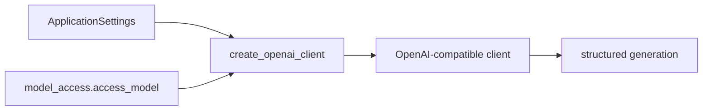

# LLM client adapter

**Status:** active gateway boundary.

`create_openai_client(settings)` is the package-level factory. `model_access.access_model()` is the
internal corporate gateway hook and reads the primary/fallback environment values expected by the
local environment. Keeping this adapter small prevents gateway details from leaking into parsing,
retrieval, or API code.

Client construction must not log credentials. Model-specific request options and response
validation belong in the generation package, not here. Cover changes with `tests/test_llm_client.py`
and `tests/test_model_access.py`.

[Package architecture](../README.md) · [Generation](../generation/README.md)

