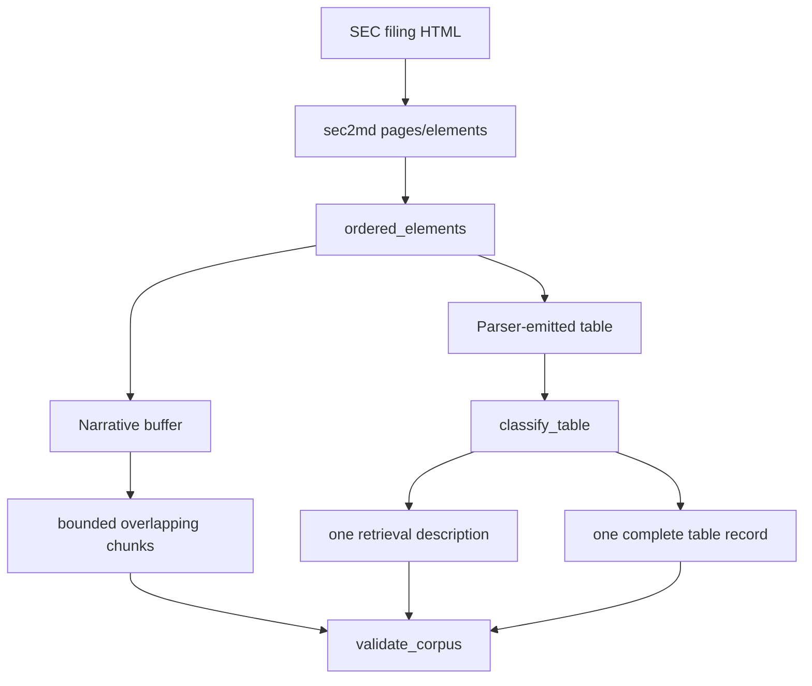

# Parsing and corpus construction

**Status:** active ingestion logic using `sec2md==0.1.23`.

## Files

| File | Responsibility |
|---|---|
| `corpus.py` | Order elements, reject navigation/furniture, split narrative units, emit records, and validate corpus integrity |
| `tables.py` | Parse Markdown grids, classify tables, extract titles/units, describe tables, and build complete table records |

## Core public functions

`build_corpus()` converts sec2md pages plus filing metadata into retrieval chunks and canonical
tables. `validate_corpus()` enforces stable IDs, supported record types, and one description for
each retrieval-eligible table. `split_to_token_limit()` preserves bounded overlap without emitting
empty or oversized records.

Table helpers include `extract_sec2md_table_grids()`, `classify_table()`, `describe_table()`, and
`build_table_record()`. Deterministic local descriptions are the default. `build_openai_description()`
is an explicit enrichment path and never replaces the source table as evidence.

## Invariants and failure modes

- Never split a table already emitted by sec2md.
- Search table descriptions, but cite the complete table through the shared `table_id`.
- Stable IDs derive from source identity and structural position, not array order alone.
- Navigation, page furniture, duplicate IDs, missing table targets, and unsupported record types
  are rejected or excluded deterministically.
- Optional LLM description failure aborts the build instead of silently changing modes.

Changes require `tests/test_corpus.py`, `tests/test_tables.py`, corpus integrity checks, and the
frozen retrieval evaluation before acceptance.

[Package architecture](../README.md) · [Processed data](../../../data/processed/README.md)

