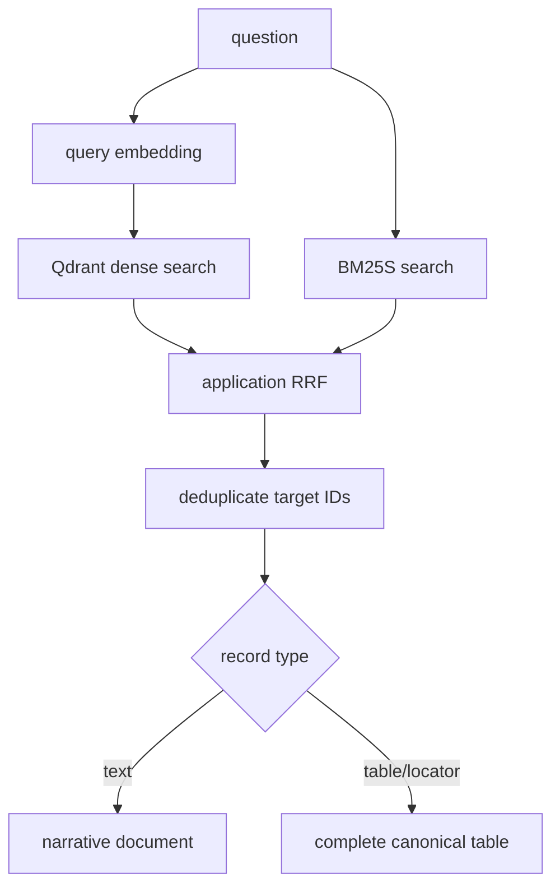

# Retrieval

**Status:** active search and evidence-hydration layer.

The default production path is mixed: persistent Qdrant dense search, in-process BM25S lexical
search, and application-level reciprocal-rank fusion.

## Files and public surface

| File | Public API | Role |
|---|---|---|
| `hybrid_retriever.py` | `HybridRetriever`, `reciprocal_rank_fusion()` | NumPy dense baseline, BM25S, fusion, filtering, hydration |
| `qdrant_retriever.py` | `QdrantRetriever`, `load_qdrant_manifest()` | Persistent dense/BM25/native-hybrid queries and manifest validation |
| `mixed_retriever.py` | `MixedRetriever` | Route dense to Qdrant, lexical to baseline, and fuse application rankings |
| `glossary_locators.py` | `is_glossary_table()`, `build_glossary_locators()`, `validate_glossary_locators()` | Create small lexical definition records targeting parent tables |

All retrievers expose compatible `search_dense`, `search_bm25`, and `search_hybrid` shapes with
optional ticker and record-type filters. Results retain record identity and metadata while the
`document` field is hydrated canonical evidence.

## Invariants and failure modes

- Candidate limits and RRF constants must be positive.
- Filters must fail when no records remain rather than searching the wrong scope.
- Duplicate glossary/table targets collapse before the requested output limit.
- Qdrant point counts, vector schema, collection name, and source hashes must match the manifest.
- Full-Qdrant hybrid remains available for comparison but is not the accepted default because it
  did not pass the recorded MRR gate.

Run the retriever unit tests and `scripts/evaluate.py` before accepting ranking changes. See ADRs
[003](../../../docs/decisions/003-qdrant-local-retrieval.md) and
[004](../../../docs/decisions/004-mixed-vector-retrieval.md).

[Package architecture](../README.md) · [Data contracts](../../../data/README.md)

