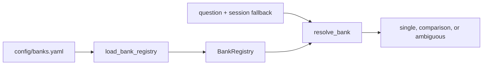

# SEC registry and bank resolution

**Status:** active domain identity layer.

## Files and public API

| File | Public symbols | Responsibility |
|---|---|---|
| `company_registry.py` | `BankCompany`, `BankRegistry`, `normalize_bank_text()`, `load_bank_registry()` | Validate identities, CIKs, aliases, duplicates, and enabled banks |
| `bank_resolver.py` | `BankResolution`, `resolve_bank()` | Match legal names, aliases, and tickers in question order with session fallback |

Resolution returns zero, one, or an ordered list of matched tickers. Zero explicit matches may use
the server-owned session scope; unsupported or more-than-four-bank requests become ambiguous
before embedding, retrieval, or generation. A one-character `C` ticker receives explicit boundary
handling to avoid normal prose matches. Normalized multi-word and sufficiently specific
single-token identifiers accept an omitted apostrophe before a possessive `s` (`JP Morgans`,
`JPMorgans`, `Bank of Americas`); short aliases do not receive that expansion because it would
create ordinary-word false positives.

## Invariants and changes

- Matching is deterministic; the LLM does not select banks.
- Duplicate mentions collapse without changing first-mention order.
- Possessive tolerance applies to multi-token identifiers or single tokens of at least six
  characters and retains ordered phrase matching.
- The configured comparison bound is two to four banks.
- Registry normalization used in tests must match runtime normalization.

Run `tests/test_company_registry.py` and `tests/test_bank_resolver.py` after changes.

[Package architecture](../README.md) · [Registry file](../../../config/README.md)
