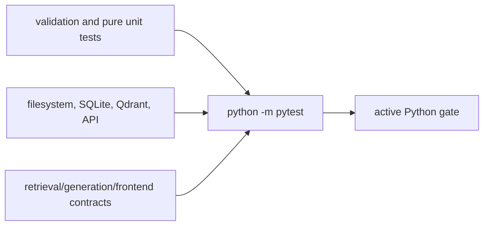

# Active test suite

**Status:** required quality gate for the current project.

Tests mirror the active package and scripts. Archived implementations have their own historical
tests under `sandbox/` and are excluded from the active pytest configuration.



## Coverage map

| Area | Representative tests |
|---|---|
| Settings, registry, resolver, I/O | `test_settings`, `test_company_registry`, `test_bank_resolver`, `test_io` |
| Parsing and tables | `test_corpus`, `test_tables`, `test_glossary_locators` |
| Retrieval and Qdrant | `test_hybrid_retriever`, `test_mixed_retriever`, `test_qdrant_retriever`, `test_retrieval_metrics` |
| Generation, planning, agentic orchestration, and comparisons | `test_answer_generator`, `test_query_planner`, `test_answer_pipeline`, `test_agentic_rag`, `test_answer_metrics`, `test_evaluate_comparisons` |
| Conversation and API | `test_contextualizer`, `test_chat_store`, `test_chat_sources`, `test_frontend_api` |
| Evaluation/client utilities | evaluator, semantic judge, embedding, download, model-access, and benchmark tests |

Most tests use temporary paths, fake clients, and small deterministic fixtures. Tests must not
depend on the developer's generated corpus, network, secret credentials, or local chat database.
Qdrant integration tests use isolated temporary stores and close clients before cleanup.

`test_agentic_rag.py` covers the four discriminated loop actions, strict action arguments, query
and number preservation, literal exact search, bounded canonical expansion, repeated-action
handling, bank/accession isolation, schema recovery, safe termination, verifier feedback, budget
limits, and the frozen 12-case challenge distribution. Evaluator tests keep retrieval-only results
authoritative even when nested end-to-end generation fails. Query-planner regressions cover
referential-only two-pair memory, peer-free bank decomposition, rewrite scope, and diversified
whole-filing summaries. API/store/frontend tests cover fragmented or malformed SSE, progress,
persisted legacy/error diagnostics, the collapsed Diagnostics panel, and blank-screen recovery.
Existing pipeline tests run with the flag off and protect baseline request/retrieval parity.

Run:

```powershell
python -m pytest
python -m ruff check .
python -m ruff format --check .
```

For a bug fix, add the smallest regression test at the owning layer. For a contract change, update
producer and consumer tests together. Frozen evaluation runs complement tests but do not replace
them.

[Repository guide](../README.md) · [Evaluation package](../src/bankscope/evaluation/README.md)
